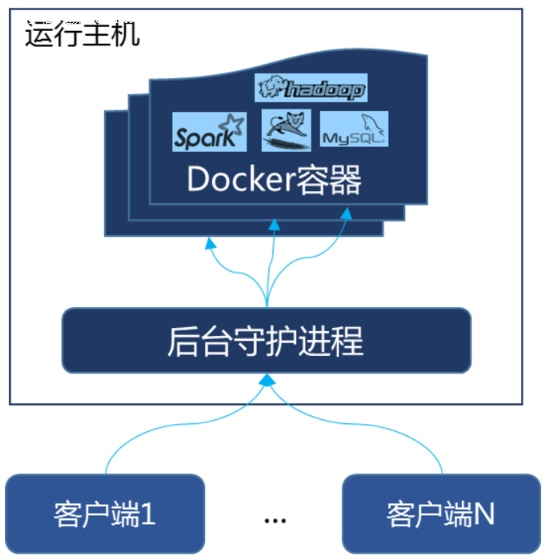

# 02. Docker安装
## 1. 前提说明
### 1.1 CentOS Docker安装

* Docker并非是一个通用的容器，它依赖于已经存在并运行的Linux内核环境。
* Docker必须部署在Linux内核的系统上。如果其他系统想要部署Docker，就必须安装一个虚拟Linux环境。


### 1.2 前提条件
目前，CentOS 仅发行版本中的内核支持 Docker。Docker 运行在CentOS 7 (64-bit)上，
要求系统为64位、Linux系统内核版本为 3.8以上，这里选用Centos7.x


### 1.3 查看系统的内核
`uname`命令用于打印当前系统的相关信息(内核版本号，硬件构架，主机名称和操作系统类型等等)


## 2. Docker的基本组成

### 2.1 镜像(image)
Docker 镜像（Image）就是一个**只读**的模板。镜像可以用来创建 Docker 容器，**一个镜像可以创建很多容器**。

它也相当于是一个root文件系统。比如官方镜像 centos:7 就包含了完整的一套 centos:7 最小系统的 root 文件系统。

相当于容器的“源代码”，docker镜像文件类似于Java的类模板，而docker容器实例类似于java中new出来的实例对象。

### 2.2 容器(container)
#### 1. 从面向对象角度
Docker利用(Container)独立运行的一个或一组应用，应用程序或服务运行在容器里，容器就类似于一个虚拟化的运行环境，**容器是用镜像创建的运行实例**。就像是Java中类和实例对象一样，镜像是静态的定义，容器是镜像运行时的实体。容器为镜像提供了一个标准的和隔离的运行环境，它可以被启动、开始、停止、删除。每个容器都是相互隔离的、保证安全的平台。

#### 2. 从镜像容器角度
**可以把容器看作是一个简易版的Linux环境**(包括root用户权限、进程空间、用户空间和网络空间等)和运行在其中的应用程序。
1. 简易的Linux环境。
2. 运行在其中的应用程序。


### 2.3 仓库(repository)
仓库(Repository)是几种存放环境文件的场所。类似于
1. Maven仓库，存放各种jar包的地方
2. Github仓库，存放各种git项目的地方

Docker公司提供的官方registry被称为Docker Hub，存放各种镜像模板的地方。

仓库分为公开仓库(Public)和私有仓库(Private)两种形式。
最大的公开仓库是Docker Hub(https://hub.docker.com/)，存放了数量庞大的镜像供用户下载。
国内的公开仓库包括阿里云，网易云等。


### 2.4 小总结
需要正确的理解仓库/镜像/容器这几个概念:
Docker本身是一个容器运行载体或称之为管理引擎。我们把应用程序和配置依赖打包好形成一个可以交付的运行环境，这个打包好的运行环境就是image镜像文件。只有通过这个镜像文件才能生成Docker容器实例(类似Java中new出来一个对象)。

image文件可以看作容器的模板。Docker根据image文件生成容器的实例。同一个image文件，可以生成多个同时运行的容器实例。

**镜像文件**
* image文件生成的容器实例，本身也是一个文件，成为镜像文件。

**容器实例**
* 一个容器运行一种服务，当我们需要的时候，就可以通过Docker客户端创建一个对应的运行实例，也就是我们的容器。

**仓库**
* 就是存放一堆镜像的地方，我们可以把镜像发布到仓库中，需要的时候再从仓库中pull下来就可以。


### 2.5 Docker平台架构图解(入门版)


#### Docker工作原理
Docker是一个Client-Server结构的系统，Docker守护进程运行在主机上，然后通过Socket连接从客户端访问，守护进程从客户端接受命令并管理运行在主机上的容器。容器，是一个运行时环境，就是logo中鲸鱼身上的集装箱。




## 3. Docker平台架构图解(构架版)
**整体架构及底层通信原理简述**

Docker是一个C/S模式的架构，后段是一个松耦合架构，众多模块各司其职。


## 4. 安装步骤
尚硅谷的课程中采用的是CentOS7安装Docker
* https://docs.docker.com/engine/install/centos/

1. 确定是CentOS7及以上的版本
2. 卸载旧版本 (https://docs.docker.com/engine/install/centos/)
3. yum安装gcc相关
   * CentOS7能上网
   * `yum -y install gcc`
   * `yum -y install gcc-c++`
4. 安装需要的软件包
   * `yum install -y yum-utils`
5. 设置stable镜像仓库
   * `yum-config-manager --add-repo yum-config-manager --add-repo http://mirrors.aliyun.com/docker-ce/linux/centos/docker-ce.repo`
6. 更新yum软件包索引
   * `yum makecache fast`
7. 安装DOCKER CE
   * `yum -y install docker-ce docker-ce-cli containerd.io`
8. 启动docker
   * `systemctl start docker`
9. 测试
   * `docker version`
   * `docker run hello-world`
10. 卸载
   * `systemctl stop docker`
   * `yum remove docker-ce docker-ce-cli containerd.io`
   * `rm -rf /var/lib/docker`
   * `rm -rf /var/lib/containerd`


## 5. 阿里云镜像加速


## 6. 永远的HelloWorld
启动后台容器，测试运行hello-world

### `docker run hello-world`
```shell
➜  ~ docker run hello-world
Unable to find image 'hello-world:latest' locally
latest: Pulling from library/hello-world
719385e32844: Pull complete
Digest: sha256:926fac19d22aa2d60f1a276b66a20eb765fbeea2db5dbdaafeb456ad8ce81598
Status: Downloaded newer image for hello-world:latest

Hello from Docker!
This message shows that your installation appears to be working correctly.

To generate this message, Docker took the following steps:
 1. The Docker client contacted the Docker daemon.
 2. The Docker daemon pulled the "hello-world" image from the Docker Hub.
    (amd64)
 3. The Docker daemon created a new container from that image which runs the
    executable that produces the output you are currently reading.
 4. The Docker daemon streamed that output to the Docker client, which sent it
    to your terminal.

To try something more ambitious, you can run an Ubuntu container with:
 $ docker run -it ubuntu bash

Share images, automate workflows, and more with a free Docker ID:
 https://hub.docker.com/

For more examples and ideas, visit:
 https://docs.docker.com/get-started/
```
输出这段提示后，hello world就会停止运行，容器自动终止。


### run干了什么


## 7. 底层原理
为什么Docker会比VM虚拟机快？

### 1. docker有着比虚拟机更少的抽象层
由于Docker不需要Hypervisor(虚拟机)实现硬件资源虚拟化，运行在docker容器上的程序直接使用的都是实际物理机的硬件资源。因此在CPU，内存利用率上，docker将会在效率上都有明显的优势。

### 2. docker利用的是宿主机的内核，而不需要加载操作系统OS内核
当新建一个容器时，docker不需要和虚拟机一样重新加载一个操作系统内核。进而避免引寻，加载操作系统内核返回等比较费时费资源的过程，当新建一个虚拟机时，虚拟机软件需要加载OS，返回新建过程是分钟等级。而docker由于直接利用宿主机的操作系统，则省略了返回过程，因此新建一个docker只需要几秒钟。


## Resources
* [Install Docker Desktop on Mac](https://docs.docker.com/desktop/install/mac-install/)

