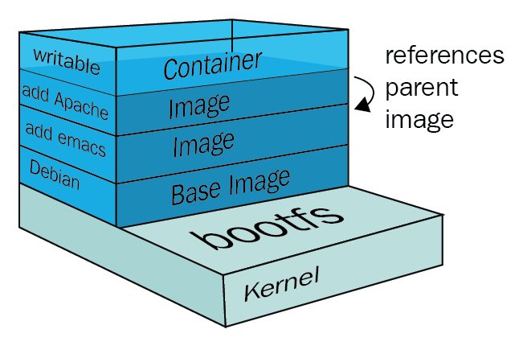

# 04. Docker镜像

## 1. 是什么？
**镜像**是一个轻量级、可执行的独立软件包，它包含运行某个软件所需要的所有内容，我们把应用程序和配置依赖打包形成一个可交付的运行环境(包括代码、运行时需要的库、环境变量和配置文件等等)。这个打包好的运行环境就是image镜像文件。

只有通过这个镜像文件才能生成Docker容器实例(类似Java中new出来一个对象)。

### 1.1 分层的镜像
以`docker pull tomcat`为例，在下载的过程中，可以看到Docker的镜像是在一层一层的下载的。
```shell
➜  ~ docker pull tomcat
Using default tag: latest
latest: Pulling from library/tomcat
9d19ee268e0d: Pull complete 
1ccd2d5dafe8: Pull complete 
79d73bf9539b: Pull complete 
75b660a991db: Pull complete 
ab3262e9d6b3: Pull complete 
2aad83b0f99a: Pull complete 
329af8ccb9c9: Pull complete 
508ee29c4d89: Pull complete 
Digest: sha256:89a80db217a4d3019a3271fc8036dcecdd70c529468661816b2ad128c58a4b55
Status: Downloaded newer image for tomcat:latest
docker.io/library/tomcat:latest

What's Next?
  View summary of image vulnerabilities and recommendations → docker scout quickview tomcat
➜  ~ 
```

### 1.2 UnionFS(联合文件系统)
UnionFS(联合文件系统): Union文件系统(UnionFS)是一种分层的、轻量级并且高效能的文件系统。**它支持对文件系统的修改作为一次提交来一层层的叠加，同时可以将不同目录挂载到同一个虚拟文件系统下(unite several directories into a single virtual filesystem)**。UnionFS是Docker镜像的基础。镜像可以通过分层来进行继承，基于基础镜像(没有父镜像)，可以制作各种具体应用的镜像。

特性: 一次同时加载多个文件系统，但从外面看起来，只能看到一个文件系统，联合加载会把各层文件系统叠加起来。这样最终的文件系统会包含所有底层的文件和目录。


### 1.3 Docker镜像加载原理
Docker镜像实际上由一层一层的文件系统组成，这种层级的文件系统就是UnionFS。


**bootfs**(boot file system)主要包含bootloader和kernel。bootloader主要是引导加载kernel，Linux刚启动时会加载bootfs文件系统，在Docker镜像的最底层是引导文件系统bootfs。这一层与我们典型的Linux/Unix系统是一样的，包含boot加载器和内核。当boot加载完成之后，这个内核就都在内存中了，此时内存的使用权由bootfs转交给内核，此时系统也会卸载bootfs。

**rootfs**(root file system)在bootfs之上。包含的就是典型Linux系统中的/dev，/proc，/bin，/etc等标准目录和文件。rootfs就是各种不同的操作系统发行版，比如Ubuntu，CentOS等等。

对于一个精简的OS，rootfs可以很小，只需要包含最基本的命令、工具和程序库就可以了，因为底层直接用host的kernel，自己只需要提供rootfs就行了。由此可见对于不同的Linux发行版，bootfs基本都是一致的，rootfs会有差别，因此不同的发行版可以共用bootfs。


### 1.4 为什么Docker镜像要采用这种分层结构呢？
镜像分层最大的一个好处就是共享资源，方便复制迁移，就是为了复用。

比如说有多个镜像都从相同的 base 镜像构建而来，那么 Docker Host 只需在磁盘上保存一份 base 镜像；同时内存中也只需加载一份 base 镜像，就可以为所有容器服务了。而且镜像的每一层都可以被共享。


## 2. 重点理解
Docker镜像层都是只读的，容器层是可写的。当容器启动时，一个新的可写层被加载到镜像的顶部。这一层通常被称为“容器层”，“容器层”之下的都是镜像层。

所有对容器的改动--无论添加、删除，还是修改文件都只会发生在容器层中。只有容器层是可写的。容器层下的所有镜像都是只读的。




## 3. Docker镜像commit操作实例
* docker commit 提交容器副本使之成为一个新的镜像
* docker commit -m="提交的描述信息" -a="作者" 容器ID 要创建的目标镜像名:[标签名]

### 3.1 案例演示ubuntu安装vim
Step 1. 从Hub上下载ubuntu镜像到本地并运行成功。此时的ubuntu:lastest镜像只有77.8MB，这个原始的ubuntu镜像是不带vim命令的。
```shell
ubuntu             latest    5a81c4b8502e   5 weeks ago     77.8MB
```

Step 2. 连接到外网的情况下，安装vim
```shell
apt-get update
apt-get -y install vim
```

Step 3. 安装vim后，commit这个带有vim命令的容器，生成新的镜像
```shell
$ docker commit -m "vim cmd added" -a="ylqi007" 6b7c1fb294c1 atguigu/myubuntu:0.0.1
sha256:10faa5de7d6e6d59135c921b777e6e358917db7a8b5df5ebee78f2d7cefa06db

$ docker images
REPOSITORY         TAG       IMAGE ID       CREATED         SIZE
atguigu/myubuntu   0.0.1     10faa5de7d6e   8 minutes ago   180MB
tomcat             latest    e46faef801b7   9 hours ago     429MB
atguigu/ubuntu     0.0.1     d33f47c9a886   2 days ago      77.8MB
ubuntu             latest    5a81c4b8502e   5 weeks ago     77.8MB
hello-world        latest    9c7a54a9a43c   3 months ago    13.3kB
redis              6.0.8     16ecd2772934   2 years ago     104MB
```
commit生成的新的镜像atguigu/myubuntu此时由180MB。

Step 4. 启动新生成的镜像atguigu/mybuntu，此时生成新的容器就是带有vim命令的
```shell
docker run -it 10faa5de7d6e /bin/bash
```


## 小总结
Docker中的镜像分层，支持通过扩展现有镜像，创建新的镜像。类似Java继承于一个Base基础类，自己再按需扩展。
新镜像是从 base 镜像一层一层叠加生成的。每安装一个软件，就在现有镜像的基础上增加一层。


## Appendix
```shell
docker run -it ubuntu /bin/bash

apt-get update

apt-get -y install vim

docker commit -m "xxx" -a="xxx" <Container ID> <要创建的目标镜像名>:[标签名]
docker commit -m "vim cmd added" -a="ylqi007" 6b7c1fb294c1 atguigu/myubuntu:0.0.1

➜  ~ docker images
REPOSITORY       TAG       IMAGE ID       CREATED        SIZE
tomcat           latest    e46faef801b7   9 hours ago    429MB
atguigu/ubuntu   0.0.1     d33f47c9a886   2 days ago     77.8MB
ubuntu           latest    5a81c4b8502e   5 weeks ago    77.8MB
hello-world      latest    9c7a54a9a43c   3 months ago   13.3kB
redis            6.0.8     16ecd2772934   2 years ago    104MB
➜  ~ docker commit -m "vim cmd added" -a="ylqi007" 6b7c1fb294c1 atguigu/myubuntu:0.0.1
sha256:10faa5de7d6e6d59135c921b777e6e358917db7a8b5df5ebee78f2d7cefa06db
➜  ~ docker images
REPOSITORY         TAG       IMAGE ID       CREATED         SIZE
atguigu/myubuntu   0.0.1     10faa5de7d6e   3 seconds ago   180MB
tomcat             latest    e46faef801b7   9 hours ago     429MB
atguigu/ubuntu     0.0.1     d33f47c9a886   2 days ago      77.8MB
ubuntu             latest    5a81c4b8502e   5 weeks ago     77.8MB
hello-world        latest    9c7a54a9a43c   3 months ago    13.3kB
redis              6.0.8     16ecd2772934   2 years ago     104MB
```

`docker commit`提交容器副本使之成为一个新的镜像。
```shell
docker commit -m "xxx" -a="xxx" <Container ID> <要创建的目标镜像名>:[标签名]
docker commit -m "vim cmd added" -a="ylqi007" 6b7c1fb294c1 atguigu/myubuntu:0.0.1
```