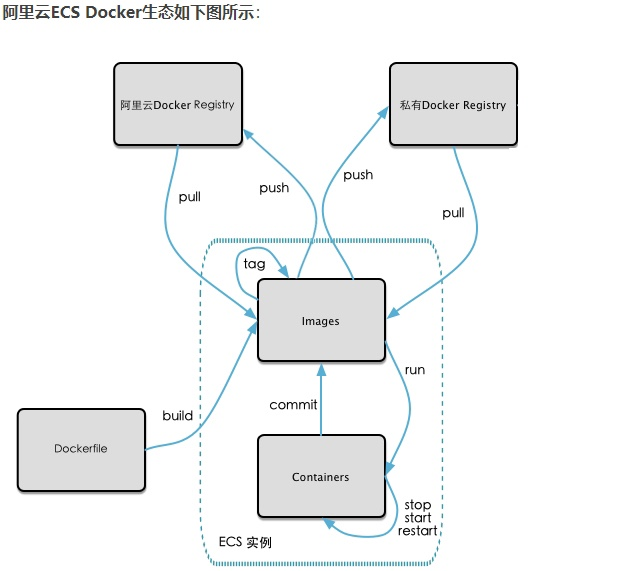
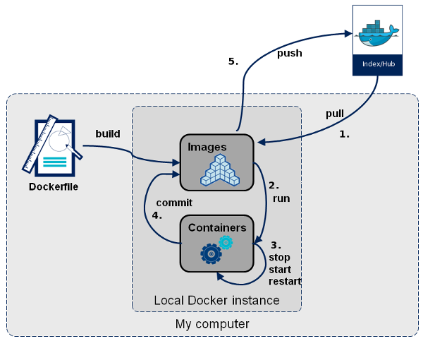

# 05. 本地镜像发布到阿里云


## 1. 本地镜像发布到remote repository的流程

* 


## 2. 镜像生成方法
### 2.1 基于当前容器创建新的镜像
基于当前容器创建新的镜像，新功能增强。
```shell
docker commit [OPTIONS] <Container ID> [REPOSITORY[:TAG]]
```
* `-a`: 提交镜像的作者
* `-m`: 提交镜像时的文字说明

### 2.2 DockerFile
基于DockerFile build生成镜像，属于高级篇的内容


## 3. 本地镜像推送到共有仓库
```shell
# 本地登录到Docker Hub仓库需要login
docker login
```

```shell
➜  Notebooks git:(Docker) ✗ docker tag --help             

Usage:  docker tag SOURCE_IMAGE[:TAG] TARGET_IMAGE[:TAG]

Create a tag TARGET_IMAGE that refers to SOURCE_IMAGE

Aliases:
  docker image tag, docker tag
```

```shell
docker tag local-image:tagname new-repo:tagname
docker push new-repo:tagname
```

```shell
docker tag namespace1/docker101tutorial new_namespace/docker101tutorial

docker tag atguigu/myubuntu:0.0.1 qitech92121/ubuntu:0.0.1

docker push qitech92121/ubuntu:0.0.1
```

```shell
# Push to Docker Hub respository qitech92121/ubuntu
➜  Notebooks git:(Docker) ✗ docker push qitech92121/ubuntu:0.0.1
The push refers to repository [docker.io/qitech92121/ubuntu]
4796fc5feaf4: Pushed 
59c56aee1fb4: Mounted from library/tomcat 
0.0.1: digest: sha256:56fe50d26607dbf667e7f3fc91e4fb555c26b0e1516a3956118139884a1836c1 size: 741
```

```shell
# Create a container with image qitech92121/ubuntu:0.0.1, and then verify if vim exists
docker run -it qitech92121/ubuntu:0.0.1 bash

# Create a container wih image ID, and then verify if vim exists
docker run -it 10faa5de7d6e bash
```


## 4. 将remote repository的镜像下载到本地
```shell
docker pull qitech92121/ubuntu:0.0.1
```
