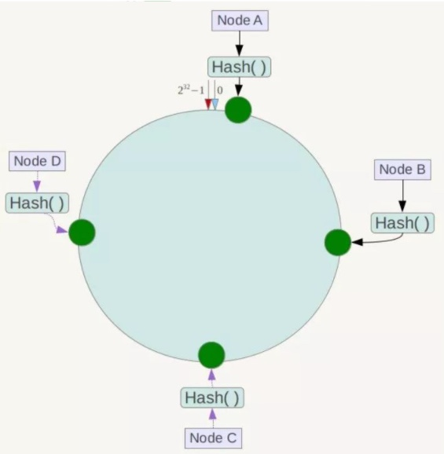
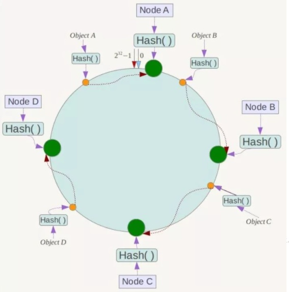
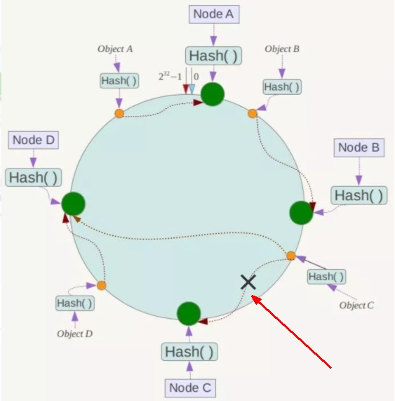
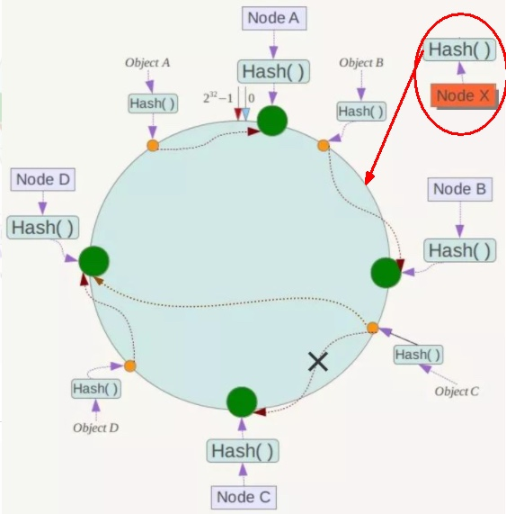
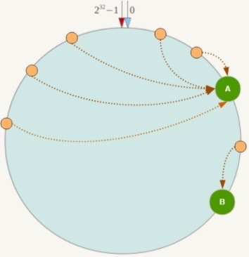
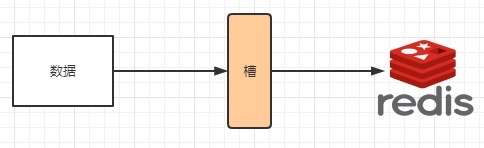
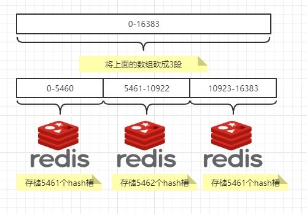

# 09 Docker复杂安装详说

## 1. 安装MySQL主从复制
搭建主从两个MySQL容器，实现主从复制。

### 1. 主从复制原理
默认懂，略过(其实我不懂)

### 2. 主从搭建步骤
**Step 1. 新建主服务器容器实例3307**
```shell
docker run -p 3307:3306 --name mysql-master \
-v /tmp/mydata/mysql-master/log:/var/log/mysql \
-v /tmp/mydata/mysql-master/data:/var/lib/mysql \
-v /tmp/mydata/mysql-master/conf:/etc/mysql/conf.d \
-e MYSQL_ROOT_PASSWORD=123456 \
-d mysql:5.7
```
1. 课件中给的命令中给的目录有个错误的地方，不是`/etc/mysql`，而是`/etc/mysql/conf.d`。否则会报`mysqld: Can't read dir of '/etc/mysql/conf.d/' (Errcode: 2 - No such file or directory)`的错误
2. host(3307) --> mysql-master(3306)
3. `log/`, `data/`, `conf/`目录分别对应日志，数据和配置目录，都使用local的目录以便即使容器销毁后也能保存数据。

**Step 2. 进入`/tmp/mysata/mysql-master/conf`目录下，新建`my.cnf`**
在`conf/`目录下创建`my.cnf`，添加对MySQL的配置。在local添加或修改配置后，需要重启才能生效。

本机的文件路径是`/tmp/mydata/mysql-master/conf/my.cnf`
```shell
[mysqld]
## 设置server_id，同一局域网中需要唯一
server_id=101
## 指定不需要同步的数据库名称
binlog-ignore-db=mysql
## 开启二进制日志功能
log-bin=mall-mysql-bin
## 设置二进制日志使用内存大小（事务）
binlog_cache_size=1M
## 设置使用的二进制日志格式（mixed,statement,row）
binlog_format=mixed
## 二进制日志过期清理时间。默认值为0，表示不自动清理。
expire_logs_days=7
## 跳过主从复制中遇到的所有错误或指定类型的错误，避免slave端复制中断。
## 如：1062错误是指一些主键重复，1032错误是因为主从数据库数据不一致
slave_skip_errors=1062
```

**Step 3. 修改完配置后，重启mysal-master实例**
```shell
docker restart mysql-master
```

**Step 4. 进入mysql-master实例，登录MySQL**
进入mysql-master容器，并登陆MySQL
```shell
docker exec -it mysql-master /bin/bash

bash-4.2# mysql -uroot -p 

mysql> show databases;
```

**Step 5. 在mysql-master容器内创建同步用户**
```shell
CREATE USER 'slave'@'%' IDENTIFIED BY 'salve123456';
CREATE USER IF NOT EXISTS 'slave'@'%' IDENTIFIED BY 'salve123456';
GRANT REPLICATION SLAVE, REPLICATION CLIENT ON *.* TO 'slave'@'%';

# Run in mysql
# 创建slave用户
mysql> CREATE USER IF NOT EXISTS 'slave'@'%' IDENTIFIED BY 'salve123456';
Query OK, 0 rows affected, 1 warning (0.00 sec)

# 收于slave用户权限
mysql> GRANT REPLICATION SLAVE, REPLICATION CLIENT ON *.* TO 'slave'@'%';
Query OK, 0 rows affected (0.00 sec)
```

**Step 6. 新建从服务器容器实例3308**
新建从服务器，mysql-slave，使用主机的端口3308
```shell
docker run -p 3308:3306 --name mysql-slave \
-v /tmp/mydata/mysql-slave/log:/var/log/mysql \
-v /tmp/mydata/mysql-slave/data:/var/lib/mysql \
-v /tmp/mydata/mysql-slave/conf:/etc/mysql/conf.d \
-e MYSQL_ROOT_PASSWORD=123456 \
-d mysql:5.7
```

**Step 7. 进入`/tmp/mydata/mysql-slave/conf`目录下，新建`my.cnf`**
本机的文件路径是`/tmp/mydata/mysql-slave/conf/my.cnf`
```shell
[mysqld]
## 设置server_id，同一局域网中需要唯一
server_id=102
## 指定不需要同步的数据库名称
binlog-ignore-db=mysql
## 开启二进制日志功能，以备Slave作为其它数据库实例的Master时使用
log-bin=mall-mysql-slave1-bin
## 设置二进制日志使用内存大小（事务）
binlog_cache_size=1M
## 设置使用的二进制日志格式（mixed,statement,row）
binlog_format=mixed
## 二进制日志过期清理时间。默认值为0，表示不自动清理。
expire_logs_days=7
## 跳过主从复制中遇到的所有错误或指定类型的错误，避免slave端复制中断。
## 如：1062错误是指一些主键重复，1032错误是因为主从数据库数据不一致
slave_skip_errors=1062
## relay_log配置中继日志
relay_log=mall-mysql-relay-bin
## log_slave_updates表示slave将复制事件写进自己的二进制日志
log_slave_updates=1
## slave设置为只读（具有super权限的用户除外）
read_only=1
```

**Step 8. 修改完配置后，重启`mysql-slave`实例**
```shell
docker restart mysql-slave
```

**Step 9. 在主数据库中查看主从同步状态**
从**主**数据库(master)中查看
```shell
mysql> show master status;
+-----------------------+----------+--------------+------------------+-------------------+
| File                  | Position | Binlog_Do_DB | Binlog_Ignore_DB | Executed_Gtid_Set |
+-----------------------+----------+--------------+------------------+-------------------+
| mall-mysql-bin.000001 |      631 |              | mysql            |                   |
+-----------------------+----------+--------------+------------------+-------------------+
1 row in set (0.00 sec)
```

**Step 10. 进入`mysql-slave`容器实例**
```shell
docker exec -it mysql-slave bash

mysql -u root -p
```

**Step 11. 在从数据库中配置主从复制**
在**从**数据库(slave)中配置
拜码头，确认master
```shell
change master to master_host='宿主机ip', master_user='slave', master_password='123456', master_port=3307, master_log_file='mall-mysql-bin.000001', master_log_pos=617, master_connect_retry=30;
```

```shell
mysql> change master to master_host='192.168.68.59', master_user='slave', master_password='salve123456', master_port=3307, master_log_file='mall-mysql-bin.000001', master_log_pos=631, master_connect_retry=30;
Query OK, 0 rows affected, 2 warnings (0.01 sec)
```
参数说明:
* master_host：主数据库的IP地址；
* master_port：主数据库的运行端口；
* master_user：在主数据库创建的用于同步数据的用户账号；
* master_password：在主数据库创建的用于同步数据的用户密码；
* master_log_file：指定从数据库要复制数据的日志文件，通过查看主数据的状态，获取File参数；
* master_log_pos：指定从数据库从哪个位置开始复制数据，通过查看主数据的状态，获取Position参数；
* master_connect_retry：连接失败重试的时间间隔，单位为秒。


通过`ifconfig`命令，查找宿主机IP地址
```shell
 ~ ifconfig
lo0: flags=8049<UP,LOOPBACK,RUNNING,MULTICAST> mtu 16384
        options=1203<RXCSUM,TXCSUM,TXSTATUS,SW_TIMESTAMP>
        inet 127.0.0.1 netmask 0xff000000 
        inet6 ::1 prefixlen 128 
        inet6 fe80::1%lo0 prefixlen 64 scopeid 0x1 
        nd6 options=201<PERFORMNUD,DAD>
gif0: flags=8010<POINTOPOINT,MULTICAST> mtu 1280
stf0: flags=0<> mtu 1280
en1: flags=8863<UP,BROADCAST,SMART,RUNNING,SIMPLEX,MULTICAST> mtu 1500
        options=400<CHANNEL_IO>
        ether b8:09:8a:50:fd:42 
        inet6 fe80::cef:dc45:29bc:4d00%en1 prefixlen 64 secured scopeid 0x4 
        inet 192.168.68.59 netmask 0xfffffc00 broadcast 192.168.71.255
        inet6 fdfe:dbb5:67aa:4bd8:188f:fc76:9827:c84c prefixlen 64 autoconf secured 
        inet6 2603:8000:4301:a0f::1001 prefixlen 128 dynamic 
        nd6 options=201<PERFORMNUD,DAD>
        media: autoselect
        status: active
en0: flags=8863<UP,BROADCAST,SMART,RUNNING,SIMPLEX,MULTICAST> mtu 1500
        options=40b<RXCSUM,TXCSUM,VLAN_HWTAGGING,CHANNEL_IO>
        ether c8:7f:54:66:e6:2f 
        nd6 options=201<PERFORMNUD,DAD>
        media: autoselect (<unknown type>)
        status: inactive
awdl0: flags=8843<UP,BROADCAST,RUNNING,SIMPLEX,MULTICAST> mtu 1484
        options=400<CHANNEL_IO>
        ether d6:d3:ee:4f:78:cd 
        inet6 fe80::d4d3:eeff:fe4f:78cd%awdl0 prefixlen 64 scopeid 0x6 
        nd6 options=201<PERFORMNUD,DAD>
        media: autoselect
        status: active
llw0: flags=8863<UP,BROADCAST,SMART,RUNNING,SIMPLEX,MULTICAST> mtu 1500
        options=400<CHANNEL_IO>
        ether d6:d3:ee:4f:78:cd 
        inet6 fe80::d4d3:eeff:fe4f:78cd%llw0 prefixlen 64 scopeid 0x7 
        nd6 options=201<PERFORMNUD,DAD>
        media: autoselect
        status: active
utun0: flags=8051<UP,POINTOPOINT,RUNNING,MULTICAST> mtu 1380
        inet6 fe80::535a:df47:7e93:a01e%utun0 prefixlen 64 scopeid 0x8 
        nd6 options=201<PERFORMNUD,DAD>
utun1: flags=8051<UP,POINTOPOINT,RUNNING,MULTICAST> mtu 2000
        inet6 fe80::2fd:f9f6:cc21:afa%utun1 prefixlen 64 scopeid 0x9 
        nd6 options=201<PERFORMNUD,DAD>
utun2: flags=8051<UP,POINTOPOINT,RUNNING,MULTICAST> mtu 1000
        inet6 fe80::ce81:b1c:bd2c:69e%utun2 prefixlen 64 scopeid 0xa 
        nd6 options=201<PERFORMNUD,DAD>
utun3: flags=8051<UP,POINTOPOINT,RUNNING,MULTICAST> mtu 1380
        inet6 fe80::ac91:9cb1:1e5:d7ff%utun3 prefixlen 64 scopeid 0xb 
        nd6 options=201<PERFORMNUD,DAD>
utun4: flags=8051<UP,POINTOPOINT,RUNNING,MULTICAST> mtu 1380
        inet6 fe80::5647:5e83:1f82:6e0e%utun4 prefixlen 64 scopeid 0xc 
        nd6 options=201<PERFORMNUD,DAD>
➜  ~ 
```
IP地址是en1对应的`inet 192.168.68.59`

**Step 12. 在从数据库中查看主从同步状态**
```shell
mysql> show slave status \G;
*************************** 1. row ***************************
               Slave_IO_State: 
                  Master_Host: 192.168.68.59
                  Master_User: slave
                  Master_Port: 3307
                Connect_Retry: 30
              Master_Log_File: mall-mysql-bin.000001
          Read_Master_Log_Pos: 631
               Relay_Log_File: mall-mysql-relay-bin.000001
                Relay_Log_Pos: 4
        Relay_Master_Log_File: mall-mysql-bin.000001
             Slave_IO_Running: No
            Slave_SQL_Running: No
              Replicate_Do_DB: 
          Replicate_Ignore_DB: 
           Replicate_Do_Table: 
       Replicate_Ignore_Table: 
      Replicate_Wild_Do_Table: 
  Replicate_Wild_Ignore_Table: 
                   Last_Errno: 0
                   Last_Error: 
                 Skip_Counter: 0
          Exec_Master_Log_Pos: 631
              Relay_Log_Space: 154
              Until_Condition: None
               Until_Log_File: 
                Until_Log_Pos: 0
           Master_SSL_Allowed: No
           Master_SSL_CA_File: 
           Master_SSL_CA_Path: 
              Master_SSL_Cert: 
            Master_SSL_Cipher: 
               Master_SSL_Key: 
        Seconds_Behind_Master: NULL
Master_SSL_Verify_Server_Cert: No
                Last_IO_Errno: 0
                Last_IO_Error: 
               Last_SQL_Errno: 0
               Last_SQL_Error: 
  Replicate_Ignore_Server_Ids: 
             Master_Server_Id: 0
                  Master_UUID: 
             Master_Info_File: /var/lib/mysql/master.info
                    SQL_Delay: 0
          SQL_Remaining_Delay: NULL
      Slave_SQL_Running_State: 
           Master_Retry_Count: 86400
                  Master_Bind: 
      Last_IO_Error_Timestamp: 
     Last_SQL_Error_Timestamp: 
               Master_SSL_Crl: 
           Master_SSL_Crlpath: 
           Retrieved_Gtid_Set: 
            Executed_Gtid_Set: 
                Auto_Position: 0
         Replicate_Rewrite_DB: 
                 Channel_Name: 
           Master_TLS_Version: 
1 row in set (0.00 sec)

ERROR: 
No query specified
```
注意 line 213， 214
```shell
Slave_IO_Running: No
Slave_SQL_Running: No
```
此时都是No，因为master还没开始给slave写入任何东西。

or
```shell
mysql> show slave status;
+----------------+---------------+-------------+-------------+---------------+-----------------------+---------------------+-----------------------------+---------------+-----------------------+------------------+-------------------+-----------------+---------------------+--------------------+------------------------+-------------------------+-----------------------------+------------+------------+--------------+---------------------+-----------------+-----------------+----------------+---------------+--------------------+--------------------+--------------------+-----------------+-------------------+----------------+-----------------------+-------------------------------+---------------+---------------+----------------+----------------+-----------------------------+------------------+-------------+----------------------------+-----------+---------------------+-------------------------+--------------------+-------------+-------------------------+--------------------------+----------------+--------------------+--------------------+-------------------+---------------+----------------------+--------------+--------------------+
| Slave_IO_State | Master_Host   | Master_User | Master_Port | Connect_Retry | Master_Log_File       | Read_Master_Log_Pos | Relay_Log_File              | Relay_Log_Pos | Relay_Master_Log_File | Slave_IO_Running | Slave_SQL_Running | Replicate_Do_DB | Replicate_Ignore_DB | Replicate_Do_Table | Replicate_Ignore_Table | Replicate_Wild_Do_Table | Replicate_Wild_Ignore_Table | Last_Errno | Last_Error | Skip_Counter | Exec_Master_Log_Pos | Relay_Log_Space | Until_Condition | Until_Log_File | Until_Log_Pos | Master_SSL_Allowed | Master_SSL_CA_File | Master_SSL_CA_Path | Master_SSL_Cert | Master_SSL_Cipher | Master_SSL_Key | Seconds_Behind_Master | Master_SSL_Verify_Server_Cert | Last_IO_Errno | Last_IO_Error | Last_SQL_Errno | Last_SQL_Error | Replicate_Ignore_Server_Ids | Master_Server_Id | Master_UUID | Master_Info_File           | SQL_Delay | SQL_Remaining_Delay | Slave_SQL_Running_State | Master_Retry_Count | Master_Bind | Last_IO_Error_Timestamp | Last_SQL_Error_Timestamp | Master_SSL_Crl | Master_SSL_Crlpath | Retrieved_Gtid_Set | Executed_Gtid_Set | Auto_Position | Replicate_Rewrite_DB | Channel_Name | Master_TLS_Version |
+----------------+---------------+-------------+-------------+---------------+-----------------------+---------------------+-----------------------------+---------------+-----------------------+------------------+-------------------+-----------------+---------------------+--------------------+------------------------+-------------------------+-----------------------------+------------+------------+--------------+---------------------+-----------------+-----------------+----------------+---------------+--------------------+--------------------+--------------------+-----------------+-------------------+----------------+-----------------------+-------------------------------+---------------+---------------+----------------+----------------+-----------------------------+------------------+-------------+----------------------------+-----------+---------------------+-------------------------+--------------------+-------------+-------------------------+--------------------------+----------------+--------------------+--------------------+-------------------+---------------+----------------------+--------------+--------------------+
|                | 192.168.68.59 | slave       |        3307 |            30 | mall-mysql-bin.000001 |                 631 | mall-mysql-relay-bin.000001 |             4 | mall-mysql-bin.000001 | No               | No                |                 |                     |                    |                        |                         |                             |          0 |            |            0 |                 631 |             154 | None            |                |             0 | No                 |                    |                    |                 |                   |                |                  NULL | No                            |             0 |               |              0 |                |                             |                0 |             | /var/lib/mysql/master.info |         0 |                NULL |                         |              86400 |             |                         |                          |                |                    |                    |                   |             0 |                      |              |                    |
+----------------+---------------+-------------+-------------+---------------+-----------------------+---------------------+-----------------------------+---------------+-----------------------+------------------+-------------------+-----------------+---------------------+--------------------+------------------------+-------------------------+-----------------------------+------------+------------+--------------+---------------------+-----------------+-----------------+----------------+---------------+--------------------+--------------------+--------------------+-----------------+-------------------+----------------+-----------------------+-------------------------------+---------------+---------------+----------------+----------------+-----------------------------+------------------+-------------+----------------------------+-----------+---------------------+-------------------------+--------------------+-------------+-------------------------+--------------------------+----------------+--------------------+--------------------+-------------------+---------------+----------------------+--------------+--------------------+
1 row in set (0.00 sec)
```


**Step 13. 在从数据库中开启中从同步**
```shell
mysql> start slave;
Query OK, 0 rows affected (0.00 sec)
```

**Step 14. 查看从数据库状态是否开始同步**
```shell
mysql> show slave status \G;
*************************** 1. row ***************************
               Slave_IO_State: Waiting for master to send event
                  Master_Host: 192.168.68.59
                  Master_User: slave
                  Master_Port: 3307
                Connect_Retry: 30
              Master_Log_File: mall-mysql-bin.000001
          Read_Master_Log_Pos: 631
               Relay_Log_File: mall-mysql-relay-bin.000002
                Relay_Log_Pos: 325
        Relay_Master_Log_File: mall-mysql-bin.000001
             Slave_IO_Running: Yes
            Slave_SQL_Running: Yes
              Replicate_Do_DB: 
          Replicate_Ignore_DB: 
           Replicate_Do_Table: 
       Replicate_Ignore_Table: 
      Replicate_Wild_Do_Table: 
  Replicate_Wild_Ignore_Table: 
                   Last_Errno: 0
                   Last_Error: 
                 Skip_Counter: 0
          Exec_Master_Log_Pos: 631
              Relay_Log_Space: 537
              Until_Condition: None
               Until_Log_File: 
                Until_Log_Pos: 0
           Master_SSL_Allowed: No
           Master_SSL_CA_File: 
           Master_SSL_CA_Path: 
              Master_SSL_Cert: 
            Master_SSL_Cipher: 
               Master_SSL_Key: 
        Seconds_Behind_Master: 0
Master_SSL_Verify_Server_Cert: No
                Last_IO_Errno: 0
                Last_IO_Error: 
               Last_SQL_Errno: 0
               Last_SQL_Error: 
  Replicate_Ignore_Server_Ids: 
             Master_Server_Id: 101
                  Master_UUID: 3e2a5f1e-3bf9-11ee-a9b3-0242ac110002
             Master_Info_File: /var/lib/mysql/master.info
                    SQL_Delay: 0
          SQL_Remaining_Delay: NULL
      Slave_SQL_Running_State: Slave has read all relay log; waiting for more updates
           Master_Retry_Count: 86400
                  Master_Bind: 
      Last_IO_Error_Timestamp: 
     Last_SQL_Error_Timestamp: 
               Master_SSL_Crl: 
           Master_SSL_Crlpath: 
           Retrieved_Gtid_Set: 
            Executed_Gtid_Set: 
                Auto_Position: 0
         Replicate_Rewrite_DB: 
                 Channel_Name: 
           Master_TLS_Version: 
1 row in set (0.00 sec)

ERROR: 
No query specified
```
此时
```shell
Slave_IO_Running: Yes
Slave_SQL_Running: Yes
```

**Step 15. 测试主从复制**
1. 主机新建库，使用库，新建表，插入数据
2. 从机使用库，查看记录

```shell
# mysql-master
create database db01;
use db01;
create table t1 (id int, name varchar(20));
insert into t1 values(1, 'z3');
select * from t1;
```

在从数据库中，查看记录
```shell
# mysql-slave
use db01;
mysql> select * from t1;
+------+------+
| id   | name |
+------+------+
|    1 | z3   |
+------+------+
1 row in set (0.00 sec)
```


## 2. 安装redis集群
cluster(集群)模式-- docker版，哈希槽分区进行亿级数据存储

### 1. 面试题：1～2亿条数据需要缓存，请问如何设计这个存储案例？
回答：单机单台100%不可能，肯定是分布式存储，用redis如何落地？

上述问题是阿里P6～P7工程案例和场景设计类必考题目，一般业界有3种解决方案
#### 1.1 哈希取余分区
2亿条记录就是2亿个`k,v`，我们单机不行必须要分布式多机，假设有3台机器构成一个集群，用户每次读写操作都是根据公式：`hash(key) % N`个机器台数，计算出哈希值，用来决定数据映射到哪一个节点上。

**优点:** 简单粗暴，直接有效，只需要预估好数据规划好节点，例如3台、8台、10台，就能保证一段时间的数据支撑。使用Hash算法让固定的一部分请求落到同一台服务器上，这样每台服务器固定处理一部分请求（并维护这些请求的信息），起到负载均衡+分而治之的作用。

**缺点:** 原来规划好的节点，进行扩容或者缩容就比较麻烦了额，不管扩缩，每次数据变动导致节点有变动，映射关系需要重新进行计算，在服务器个数固定不变时没有问题，如果需要弹性扩容或故障停机的情况下，原来的取模公式就会发生变化：Hash(key)/3会变成Hash(key) /?。此时地址经过取余运算的结果将发生很大变化，根据公式获取的服务器也会变得不可控。
某个redis机器宕机了，由于台数数量变化，会导致hash取余全部数据重新洗牌。

#### 1.2 一致性哈希算法分区
一致性Hash算法背景：一致性哈希算法在1997年由麻省理工学院中提出的，设计目标是为了解决**分布式缓存数据变动和映射问题，某个机器宕机了，分母数量改变了，自然取余数不OK了**。

能干嘛？提出一致性Hash解决方案，目的是当服务器个数减少，发生变动时，尽量减少影响客户端到服务器的映射关系。

**3大步骤**
1. 一致性哈希环：一致性哈希算法必然有个hash函数并按照算法产生hash值，这个算法的所有可能哈希值会构成一个全量集，这个集合可以成为一个hash空间[0,2^32-1]，这个是一个线性空间，但是在算法中，我们通过适当的逻辑控制将它首尾相连(0 = 2^32),这样让它逻辑上形成了一个环形空间。 它也是按照使用取模的方法，前面笔记介绍的节点取模法是对节点（服务器）的数量进行取模。而一致性Hash算法是对2^32取模，简单来说，一致性Hash算法将整个哈希值空间组织成一个虚拟的圆环，如假设某哈希函数H的值空间为0-2^32-1（即哈希值是一个32位无符号整形），整个哈希环如下图：整个空间按顺时针方向组织，圆环的正上方的点代表0，0点右侧的第一个点代表1，以此类推，2、3、4、……直到2^32-1，也就是说0点左侧的第一个点代表2^32-1， 0和2^32-1在零点中方向重合，我们把这个由2^32个点组成的圆环称为Hash环。
    
    

2. 服务器节点映射：将集群中各个IP节点映射到环上的某一个位置。将各个服务器使用Hash进行一个哈希，具体可以选择服务器的IP或主机名作为关键字进行哈希，这样每台机器就能确定其在哈希环上的位置。假如4个节点NodeA、B、C、D，经过IP地址的哈希函数计算(hash(ip))，使用IP地址哈希后在环空间的位置如下：
    
    

3. key落到服务器的落键规则：当我们需要存储一个kv键值对时，首先计算key的hash值，hash(key)，将这个key使用相同的函数Hash计算出哈希值并确定此数据在环上的位置，从此位置沿环顺时针“行走”，第一台遇到的服务器就是其应该定位到的服务器，并将该键值对存储在该节点上。
如我们有Object A、Object B、Object C、Object D四个数据对象，经过哈希计算后，在环空间上的位置如下：根据一致性Hash算法，数据A会被定为到Node A上，B被定为到Node B上，C被定为到Node C上，D被定为到Node D上。

    

**优点:** 
1. 一致性哈希算法的容错性。假设Node C宕机，可以看到此时对象A、B、D不会受到影响，只有C对象被重定位到Node D。一般的，在一致性Hash算法中，如果一台服务器不可用，则受影响的数据仅仅是此服务器到其环空间中前一台服务器（即沿着逆时针方向行走遇到的第一台服务器）之间数据，其它不会受到影响。简单说，就是C挂了，受到影响的只是B、C之间的数据，并且这些数据会转移到D进行存储。

2. 扩展性：数据量增加了，需要增加一台节点NodeX，X的位置在A和B之间，那收到影响的也就是A到X之间的数据，重新把A到X的数据录入到X上即可，不会导致hash取余全部数据重新洗牌。


**缺点:**
1. Hash环的数据倾斜问题：一致性Hash算法在服务节点太少时，容易因为节点分布不均匀而造成数据倾斜（被缓存的对象大部分集中缓存在某一台服务器上）问题。例如系统中只有两台服务器：
    
    

**小总结:** 
为了在节点数目发生改变时尽可能少的迁移数据将所有的存储节点排列在收尾相接的Hash环上，每个key在计算Hash后会顺时针找到临近的存储节点存放。而当有节点加入或退出时仅影响该节点在Hash环上顺时针相邻的后续节点。  
* 优点：加入和删除节点只影响哈希环中顺时针方向的相邻的节点，对其他节点无影响。
* 缺点：数据的分布和节点的位置有关，因为这些节点不是均匀的分布在哈希环上的，所以数据在进行存储时达不到均匀分布的效果。


#### 1.3 哈希槽分区
**是什么？**
1. 为什么出现？为了解决一致性哈希算法的**数据倾斜**问题。哈希槽实质就是一个数组，数组[0,2^14 -1]形成hash slot空间。
2. 能干什么？解决均匀分配的问题，在数据和节点之间又加入了一层，把这层称为哈希槽（slot），用于管理数据和节点之间的关系，现在就相当于节点上放的是槽，槽里放的是数据。槽解决的是粒度问题，相当于把粒度变大了，这样便于数据移动。哈希解决的是映射问题，使用key的哈希值来计算所在的槽，便于数据分配。
    
    

3. 多少个hash槽？一个集群只能有16384个槽，编号0-16383（0-2^14-1）。这些槽会分配给集群中的所有主节点，分配策略没有要求。可以指定哪些编号的槽分配给哪个主节点。集群会记录节点和槽的对应关系。解决了节点和槽的关系后，接下来就需要对key求哈希值，然后对16384取余，余数是几key就落入对应的槽里。slot = CRC16(key) % 16384。以槽为单位移动数据，因为槽的数目是固定的，处理起来比较容易，这样数据移动问题就解决了。

**哈希槽计算**
Redis 集群中内置了 16384 个哈希槽，redis 会根据节点数量大致均等的将哈希槽映射到不同的节点。当需要在 Redis 集群中放置一个 key-value时，redis 先对 key 使用 crc16 算法算出一个结果，然后把结果对 16384 求余数，这样每个 key 都会对应一个编号在 0-16383 之间的哈希槽，也就是映射到某个节点上。如下代码，key之A 、B在Node2， key之C落在Node3上
    
    


### 2. 3主3从Redis集群
打开步骤
#### 1. 启动Docker后台服务
关闭防火墙+启动docker后台服务
```shell
systemctl start docker
```

#### 2. 启动6个容器
```shell
docker run -d --name redis-node-1 --net host --privileged=true -v /tmp/data/redis/share/redis-node-1:/data redis:6.0.8 --cluster-enabled yes --appendonly yes --port 6381

docker run -d --name redis-node-2 --net host --privileged=true -v /tmp/data/redis/share/redis-node-2:/data redis:6.0.8 --cluster-enabled yes --appendonly yes --port 6382

docker run -d --name redis-node-3 --net host --privileged=true -v /tmp/data/redis/share/redis-node-3:/data redis:6.0.8 --cluster-enabled yes --appendonly yes --port 6383

docker run -d --name redis-node-4 --net host --privileged=true -v /tmp/data/redis/share/redis-node-4:/data redis:6.0.8 --cluster-enabled yes --appendonly yes --port 6384

docker run -d --name redis-node-5 --net host --privileged=true -v /tmp/data/redis/share/redis-node-5:/data redis:6.0.8 --cluster-enabled yes --appendonly yes --port 6385

docker run -d --name redis-node-6 --net host --privileged=true -v /tmp/data/redis/share/redis-node-6:/data redis:6.0.8 --cluster-enabled yes --appendonly yes --port 6386
```
* `docker run`: 创建并运行docker容器实例
* `--name redis-node-6`: 容器名字
* `--net host`: 使用宿主机的IP和端口，默认
* `--previleged=true`: 获取宿主机root用户的权限
* `-v /tmp/data/redis/share/redis-node-6:/data`: 容器卷，宿主机地址:docker内部地址 
* `redis:6.0.8`: redis镜像和版本号
* `--cluster-enabled yes`: 开启redis集群
* `--appendonly yes`: 开启持久化
* `--port 6386`: redis端口号

#### 3. 进入redis-node-1并为6台容器构建集群关系

```shell
docker exec -it redis-node-1 /bin/bash  # 进入节点1

//注意，进入docker容器后才能执行一下命令，且注意自己的真实IP地址
redis-cli --cluster create 192.168.68.59:6381 192.168.68.59:6382 192.168.68.59:6383 192.168.68.59:6384 192.168.68.59:6385 192.168.68.59:6386 --cluster-replicas 1
```
* 我的主机IP地址为：192.168.68.59
* `--cluster-replicas 1`: 表示为每个master创建一个slave节点，也就是每组中1主1从
* 使用主机IP地址会报错

```shell
root@docker-desktop:/data# redis-cli --cluster create 127.0.0.1:6381 127.0.0.1:6382 127.0.0.1:6383 127.0.0.1:6384 127.0.0.1:6385 127.0.0.1:6386 --cluster-replicas 1 
>>> Performing hash slots allocation on 6 nodes...
Master[0] -> Slots 0 - 5460
Master[1] -> Slots 5461 - 10922
Master[2] -> Slots 10923 - 16383
Adding replica 127.0.0.1:6385 to 127.0.0.1:6381
Adding replica 127.0.0.1:6386 to 127.0.0.1:6382
Adding replica 127.0.0.1:6384 to 127.0.0.1:6383
>>> Trying to optimize slaves allocation for anti-affinity
[WARNING] Some slaves are in the same host as their master
M: 533dfd87ddd271f565f3875a8052353d6eab1605 127.0.0.1:6381
   slots:[0-5460] (5461 slots) master
M: f30867a03f9ce16481d19dfd8f72bcbf4399660c 127.0.0.1:6382
   slots:[5461-10922] (5462 slots) master
M: 1bb09edbe886408ec7796c3d9b2eba1d1111d03f 127.0.0.1:6383
   slots:[10923-16383] (5461 slots) master
S: cc2c07fbbb3b7660d280c55908339f1d4cd0e1c3 127.0.0.1:6384
   replicates 1bb09edbe886408ec7796c3d9b2eba1d1111d03f
S: 0d713fcf1ef2283204346d85d9df605549a50a26 127.0.0.1:6385
   replicates 533dfd87ddd271f565f3875a8052353d6eab1605
S: 7b507196963c2b9726b02b460c352dd3b4ac4a11 127.0.0.1:6386
   replicates f30867a03f9ce16481d19dfd8f72bcbf4399660c
Can I set the above configuration? (type 'yes' to accept): yes
>>> Nodes configuration updated
>>> Assign a different config epoch to each node
>>> Sending CLUSTER MEET messages to join the cluster
Waiting for the cluster to join
.
>>> Performing Cluster Check (using node 127.0.0.1:6381)
M: 533dfd87ddd271f565f3875a8052353d6eab1605 127.0.0.1:6381
   slots:[0-5460] (5461 slots) master
   1 additional replica(s)
M: f30867a03f9ce16481d19dfd8f72bcbf4399660c 127.0.0.1:6382
   slots:[5461-10922] (5462 slots) master
   1 additional replica(s)
S: 7b507196963c2b9726b02b460c352dd3b4ac4a11 127.0.0.1:6386
   slots: (0 slots) slave
   replicates f30867a03f9ce16481d19dfd8f72bcbf4399660c
S: 0d713fcf1ef2283204346d85d9df605549a50a26 127.0.0.1:6385
   slots: (0 slots) slave
   replicates 533dfd87ddd271f565f3875a8052353d6eab1605
M: 1bb09edbe886408ec7796c3d9b2eba1d1111d03f 127.0.0.1:6383
   slots:[10923-16383] (5461 slots) master
   1 additional replica(s)
S: cc2c07fbbb3b7660d280c55908339f1d4cd0e1c3 127.0.0.1:6384
   slots: (0 slots) slave
   replicates 1bb09edbe886408ec7796c3d9b2eba1d1111d03f
[OK] All nodes agree about slots configuration.
>>> Check for open slots...
>>> Check slots coverage...
[OK] All 16384 slots covered.
root@docker-desktop:/data# 
```

链接进入6381作为切入点，查看节点状态
```shell
root@docker-desktop:/data# redis-cli -p 6381
127.0.0.1:6381> keys *
(empty array)
127.0.0.1:6381> cluster info
cluster_state:ok
cluster_slots_assigned:16384
cluster_slots_ok:16384
cluster_slots_pfail:0
cluster_slots_fail:0
cluster_known_nodes:6
cluster_size:3
cluster_current_epoch:6
cluster_my_epoch:1
cluster_stats_messages_ping_sent:227
cluster_stats_messages_pong_sent:235
cluster_stats_messages_sent:462
cluster_stats_messages_ping_received:230
cluster_stats_messages_pong_received:227
cluster_stats_messages_meet_received:5
cluster_stats_messages_received:462
127.0.0.1:6381> 

127.0.0.1:6381> cluster nodes
f30867a03f9ce16481d19dfd8f72bcbf4399660c 127.0.0.1:6382@16382 master - 0 1693096348469 2 connected 5461-10922
533dfd87ddd271f565f3875a8052353d6eab1605 127.0.0.1:6381@16381 myself,master - 0 1693096350000 1 connected 0-5460
7b507196963c2b9726b02b460c352dd3b4ac4a11 127.0.0.1:6386@16386 slave f30867a03f9ce16481d19dfd8f72bcbf4399660c 0 1693096350000 2 connected
0d713fcf1ef2283204346d85d9df605549a50a26 127.0.0.1:6385@16385 slave 533dfd87ddd271f565f3875a8052353d6eab1605 0 1693096350475 1 connected
1bb09edbe886408ec7796c3d9b2eba1d1111d03f 127.0.0.1:6383@16383 master - 0 1693096351478 3 connected 10923-16383
cc2c07fbbb3b7660d280c55908339f1d4cd0e1c3 127.0.0.1:6384@16384 slave 1bb09edbe886408ec7796c3d9b2eba1d1111d03f 0 1693096350000 3 connected
```
* master 16381 <-- 16385
* master 16382 <-- 16386
* master 16383 <-- 16384


### 主从容错切换迁移案例
#### 1. 数据读写存储
```shell
root@docker-desktop:/data# redis-cli -p 6381
127.0.0.1:6381>
127.0.0.1:6381> keys *
(empty array)
127.0.0.1:6381> set k1 v1
(error) MOVED 12706 127.0.0.1:6383
127.0.0.1:6381> set k2 v2
OK
127.0.0.1:6381> set k3 v3
OK
127.0.0.1:6381> set k4 v3
(error) MOVED 8455 127.0.0.1:6382
```
* `redis-cli -p 6381`会进入单个容器，而不是集群

```shell
➜  ~ docker exec -it redis-node-1 /bin/bash
root@docker-desktop:/data#

root@docker-desktop:/data# redis-cli -p 6381 -c

127.0.0.1:6381> FLUSHALL    # 清空刚才存的数据
OK

127.0.0.1:6381> set k1 v1
-> Redirected to slot [12706] located at 127.0.0.1:6383
OK
127.0.0.1:6383> set k2 v2       # 注意：127.0.0.1:6381 跳转到了 127.0.0.1:6383
-> Redirected to slot [449] located at 127.0.0.1:6381
OK
127.0.0.1:6381> set k3 v3
OK
127.0.0.1:6381> set k4 v4
-> Redirected to slot [8455] located at 127.0.0.1:6382
OK
```

查看集群
```shell
root@docker-desktop:/data# redis-cli --cluster check 192.168.68.59:6381
Could not connect to Redis at 192.168.68.59:6381: Connection refused
root@docker-desktop:/data# redis-cli --cluster check 127.0.0.1:6381
127.0.0.1:6381 (533dfd87...) -> 2 keys | 5461 slots | 1 slaves.
127.0.0.1:6382 (f30867a0...) -> 1 keys | 5462 slots | 1 slaves.
127.0.0.1:6383 (1bb09edb...) -> 1 keys | 5461 slots | 1 slaves.
[OK] 4 keys in 3 masters.
0.00 keys per slot on average.
>>> Performing Cluster Check (using node 127.0.0.1:6381)
M: 533dfd87ddd271f565f3875a8052353d6eab1605 127.0.0.1:6381
   slots:[0-5460] (5461 slots) master
   1 additional replica(s)
M: f30867a03f9ce16481d19dfd8f72bcbf4399660c 127.0.0.1:6382
   slots:[5461-10922] (5462 slots) master
   1 additional replica(s)
S: 7b507196963c2b9726b02b460c352dd3b4ac4a11 127.0.0.1:6386
   slots: (0 slots) slave
   replicates f30867a03f9ce16481d19dfd8f72bcbf4399660c
S: 0d713fcf1ef2283204346d85d9df605549a50a26 127.0.0.1:6385
   slots: (0 slots) slave
   replicates 533dfd87ddd271f565f3875a8052353d6eab1605
M: 1bb09edbe886408ec7796c3d9b2eba1d1111d03f 127.0.0.1:6383
   slots:[10923-16383] (5461 slots) master
   1 additional replica(s)
S: cc2c07fbbb3b7660d280c55908339f1d4cd0e1c3 127.0.0.1:6384
   slots: (0 slots) slave
   replicates 1bb09edbe886408ec7796c3d9b2eba1d1111d03f
[OK] All nodes agree about slots configuration.
>>> Check for open slots...
>>> Check slots coverage...
[OK] All 16384 slots covered.
```


#### 2. 容错切换迁移
Redis集群主从切换(1号机宕机，5号机上位)
* master 16381 <-- 16385
* master 16382 <-- 16386
* master 16383 <-- 16384

```shell
root@docker-desktop:/data# redis-cli -p 6381
127.0.0.1:6381> cluster nodes
f30867a03f9ce16481d19dfd8f72bcbf4399660c 127.0.0.1:6382@16382 master - 0 1693097674000 2 connected 5461-10922
533dfd87ddd271f565f3875a8052353d6eab1605 127.0.0.1:6381@16381 myself,master - 0 1693097672000 1 connected 0-5460
7b507196963c2b9726b02b460c352dd3b4ac4a11 127.0.0.1:6386@16386 slave f30867a03f9ce16481d19dfd8f72bcbf4399660c 0 1693097676500 2 connected
0d713fcf1ef2283204346d85d9df605549a50a26 127.0.0.1:6385@16385 slave 533dfd87ddd271f565f3875a8052353d6eab1605 0 1693097675000 1 connected
1bb09edbe886408ec7796c3d9b2eba1d1111d03f 127.0.0.1:6383@16383 master - 0 1693097676000 3 connected 10923-16383
cc2c07fbbb3b7660d280c55908339f1d4cd0e1c3 127.0.0.1:6384@16384 slave 1bb09edbe886408ec7796c3d9b2eba1d1111d03f 0 1693097677503 3 connected
```

手动停止redis-node-1，模拟宕机
```shell
➜  ~ docker ps
CONTAINER ID   IMAGE         COMMAND                  CREATED          STATUS          PORTS     NAMES
1026a016d517   redis:6.0.8   "docker-entrypoint.s…"   53 minutes ago   Up 32 minutes             redis-node-6
ff4254c1f8a4   redis:6.0.8   "docker-entrypoint.s…"   53 minutes ago   Up 32 minutes             redis-node-5
6cc8ed01de01   redis:6.0.8   "docker-entrypoint.s…"   53 minutes ago   Up 32 minutes             redis-node-4
1f8609b75d5b   redis:6.0.8   "docker-entrypoint.s…"   53 minutes ago   Up 32 minutes             redis-node-3
6ccf598d416a   redis:6.0.8   "docker-entrypoint.s…"   53 minutes ago   Up 32 minutes             redis-node-2
a274e4f3d96f   redis:6.0.8   "docker-entrypoint.s…"   53 minutes ago   Up 32 minutes             redis-node-1
➜  ~ docker stop redis-node-1
redis-node-1
➜  ~ docker ps
CONTAINER ID   IMAGE         COMMAND                  CREATED          STATUS          PORTS     NAMES
1026a016d517   redis:6.0.8   "docker-entrypoint.s…"   53 minutes ago   Up 32 minutes             redis-node-6
ff4254c1f8a4   redis:6.0.8   "docker-entrypoint.s…"   53 minutes ago   Up 32 minutes             redis-node-5
6cc8ed01de01   redis:6.0.8   "docker-entrypoint.s…"   53 minutes ago   Up 32 minutes             redis-node-4
1f8609b75d5b   redis:6.0.8   "docker-entrypoint.s…"   53 minutes ago   Up 32 minutes             redis-node-3
6ccf598d416a   redis:6.0.8   "docker-entrypoint.s…"   53 minutes ago   Up 32 minutes             redis-node-2
➜  ~
```


```shell
➜  ~ docker exec -it redis-node-2 /bin/bash
root@docker-desktop:/data# redis-cli -p 6382 -c
127.0.0.1:6382> cluster nodes
f30867a03f9ce16481d19dfd8f72bcbf4399660c 127.0.0.1:6382@16382 myself,master - 0 1693097831000 2 connected 5461-10922
7b507196963c2b9726b02b460c352dd3b4ac4a11 127.0.0.1:6386@16386 slave f30867a03f9ce16481d19dfd8f72bcbf4399660c 0 1693097833966 2 connected
cc2c07fbbb3b7660d280c55908339f1d4cd0e1c3 127.0.0.1:6384@16384 slave 1bb09edbe886408ec7796c3d9b2eba1d1111d03f 0 1693097831000 3 connected
533dfd87ddd271f565f3875a8052353d6eab1605 127.0.0.1:6381@16381 master,fail - 1693097737590 1693097733577 1 disconnected
0d713fcf1ef2283204346d85d9df605549a50a26 127.0.0.1:6385@16385 master - 0 1693097832000 7 connected 0-5460
1bb09edbe886408ec7796c3d9b2eba1d1111d03f 127.0.0.1:6383@16383 master - 0 1693097832963 3 connected 10923-16383
```
* 16381宕机，16385上位成为master

```shell
127.0.0.1:6382> get k1
-> Redirected to slot [12706] located at 127.0.0.1:6383
"v1"
127.0.0.1:6383> get k2
-> Redirected to slot [449] located at 127.0.0.1:6385
"v2"
127.0.0.1:6385> get k3
"v3"
127.0.0.1:6385> get k4
-> Redirected to slot [8455] located at 127.0.0.1:6382
"v4"
```

16381重新回来后，新的集群状态？
```shell
➜  ~ docker ps
CONTAINER ID   IMAGE         COMMAND                  CREATED          STATUS          PORTS     NAMES
1026a016d517   redis:6.0.8   "docker-entrypoint.s…"   57 minutes ago   Up 36 minutes             redis-node-6
ff4254c1f8a4   redis:6.0.8   "docker-entrypoint.s…"   57 minutes ago   Up 36 minutes             redis-node-5
6cc8ed01de01   redis:6.0.8   "docker-entrypoint.s…"   57 minutes ago   Up 36 minutes             redis-node-4
1f8609b75d5b   redis:6.0.8   "docker-entrypoint.s…"   57 minutes ago   Up 36 minutes             redis-node-3
6ccf598d416a   redis:6.0.8   "docker-entrypoint.s…"   57 minutes ago   Up 36 minutes             redis-node-2
➜  ~ docker restart redis-node-1
redis-node-1
➜  ~ docker ps
CONTAINER ID   IMAGE         COMMAND                  CREATED          STATUS          PORTS     NAMES
1026a016d517   redis:6.0.8   "docker-entrypoint.s…"   57 minutes ago   Up 37 minutes             redis-node-6
ff4254c1f8a4   redis:6.0.8   "docker-entrypoint.s…"   57 minutes ago   Up 37 minutes             redis-node-5
6cc8ed01de01   redis:6.0.8   "docker-entrypoint.s…"   57 minutes ago   Up 37 minutes             redis-node-4
1f8609b75d5b   redis:6.0.8   "docker-entrypoint.s…"   57 minutes ago   Up 37 minutes             redis-node-3
6ccf598d416a   redis:6.0.8   "docker-entrypoint.s…"   57 minutes ago   Up 37 minutes             redis-node-2
a274e4f3d96f   redis:6.0.8   "docker-entrypoint.s…"   57 minutes ago   Up 2 seconds              redis-node-1
➜  ~
```

```shell
127.0.0.1:6382> cluster nodes
f30867a03f9ce16481d19dfd8f72bcbf4399660c 127.0.0.1:6382@16382 myself,master - 0 1693098046000 2 connected 5461-10922
7b507196963c2b9726b02b460c352dd3b4ac4a11 127.0.0.1:6386@16386 slave f30867a03f9ce16481d19dfd8f72bcbf4399660c 0 1693098045000 2 connected
cc2c07fbbb3b7660d280c55908339f1d4cd0e1c3 127.0.0.1:6384@16384 slave 1bb09edbe886408ec7796c3d9b2eba1d1111d03f 0 1693098045000 3 connected
533dfd87ddd271f565f3875a8052353d6eab1605 127.0.0.1:6381@16381 slave 0d713fcf1ef2283204346d85d9df605549a50a26 0 1693098044761 7 connected
0d713fcf1ef2283204346d85d9df605549a50a26 127.0.0.1:6385@16385 master - 0 1693098045764 7 connected 0-5460
1bb09edbe886408ec7796c3d9b2eba1d1111d03f 127.0.0.1:6383@16383 master - 0 1693098046765 3 connected 10923-16383
```
* 16385还是master，16381此时是slave


如果想要恢复原状呢？
```shell
➜  ~ docker stop redis-node-5

127.0.0.1:6382> cluster nodes
f30867a03f9ce16481d19dfd8f72bcbf4399660c 127.0.0.1:6382@16382 myself,master - 0 1693098180000 2 connected 5461-10922
7b507196963c2b9726b02b460c352dd3b4ac4a11 127.0.0.1:6386@16386 slave f30867a03f9ce16481d19dfd8f72bcbf4399660c 0 1693098181000 2 connected
cc2c07fbbb3b7660d280c55908339f1d4cd0e1c3 127.0.0.1:6384@16384 slave 1bb09edbe886408ec7796c3d9b2eba1d1111d03f 0 1693098179000 3 connected
533dfd87ddd271f565f3875a8052353d6eab1605 127.0.0.1:6381@16381 master - 0 1693098181209 8 connected 0-5460
0d713fcf1ef2283204346d85d9df605549a50a26 127.0.0.1:6385@16385 master,fail - 1693098163133 1693098160000 7 disconnected
1bb09edbe886408ec7796c3d9b2eba1d1111d03f 127.0.0.1:6383@16383 master - 0 1693098180204 3 connected 10923-16383

➜  ~ docker restart redis-node-5
127.0.0.1:6382> cluster nodes
f30867a03f9ce16481d19dfd8f72bcbf4399660c 127.0.0.1:6382@16382 myself,master - 0 1693098236000 2 connected 5461-10922
7b507196963c2b9726b02b460c352dd3b4ac4a11 127.0.0.1:6386@16386 slave f30867a03f9ce16481d19dfd8f72bcbf4399660c 0 1693098237000 2 connected
cc2c07fbbb3b7660d280c55908339f1d4cd0e1c3 127.0.0.1:6384@16384 slave 1bb09edbe886408ec7796c3d9b2eba1d1111d03f 0 1693098237000 3 connected
533dfd87ddd271f565f3875a8052353d6eab1605 127.0.0.1:6381@16381 master - 0 1693098237420 8 connected 0-5460
0d713fcf1ef2283204346d85d9df605549a50a26 127.0.0.1:6385@16385 slave 533dfd87ddd271f565f3875a8052353d6eab1605 0 1693098233406 8 connected
1bb09edbe886408ec7796c3d9b2eba1d1111d03f 127.0.0.1:6383@16383 master - 0 1693098238423 3 connected 10923-16383
```

```shell
root@docker-desktop:/data# redis-cli --cluster check 127.0.0.1:6381
127.0.0.1:6381 (533dfd87...) -> 2 keys | 5461 slots | 1 slaves.
127.0.0.1:6382 (f30867a0...) -> 1 keys | 5462 slots | 1 slaves.
127.0.0.1:6383 (1bb09edb...) -> 1 keys | 5461 slots | 1 slaves.
[OK] 4 keys in 3 masters.
0.00 keys per slot on average.
>>> Performing Cluster Check (using node 127.0.0.1:6381)
M: 533dfd87ddd271f565f3875a8052353d6eab1605 127.0.0.1:6381
   slots:[0-5460] (5461 slots) master
   1 additional replica(s)
M: f30867a03f9ce16481d19dfd8f72bcbf4399660c 127.0.0.1:6382
   slots:[5461-10922] (5462 slots) master
   1 additional replica(s)
M: 1bb09edbe886408ec7796c3d9b2eba1d1111d03f 127.0.0.1:6383
   slots:[10923-16383] (5461 slots) master
   1 additional replica(s)
S: 0d713fcf1ef2283204346d85d9df605549a50a26 127.0.0.1:6385
   slots: (0 slots) slave
   replicates 533dfd87ddd271f565f3875a8052353d6eab1605
S: cc2c07fbbb3b7660d280c55908339f1d4cd0e1c3 127.0.0.1:6384
   slots: (0 slots) slave
   replicates 1bb09edbe886408ec7796c3d9b2eba1d1111d03f
S: 7b507196963c2b9726b02b460c352dd3b4ac4a11 127.0.0.1:6386
   slots: (0 slots) slave
   replicates f30867a03f9ce16481d19dfd8f72bcbf4399660c
[OK] All nodes agree about slots configuration.
>>> Check for open slots...
>>> Check slots coverage...
[OK] All 16384 slots covered.
```


#### 主从扩容
3主3从 --> 4主4从

```shell
docker run -d --name redis-node-7 --net host --privileged=true -v /tmp/data/redis/share/redis-node-7:/data redis:6.0.8 --cluster-enabled yes --appendonly yes --port 6387

docker run -d --name redis-node-8 --net host --privileged=true -v /tmp/data/redis/share/redis-node-8:/data redis:6.0.8 --cluster-enabled yes --appendonly yes --port 6388

docker ps
CONTAINER ID   IMAGE         COMMAND                  CREATED             STATUS          PORTS     NAMES
e03a16ece863   redis:6.0.8   "docker-entrypoint.s…"   16 seconds ago      Up 16 seconds             redis-node-8
bfaf608056b2   redis:6.0.8   "docker-entrypoint.s…"   16 seconds ago      Up 16 seconds             redis-node-7
1026a016d517   redis:6.0.8   "docker-entrypoint.s…"   About an hour ago   Up 56 minutes             redis-node-6
ff4254c1f8a4   redis:6.0.8   "docker-entrypoint.s…"   About an hour ago   Up 16 minutes             redis-node-5
6cc8ed01de01   redis:6.0.8   "docker-entrypoint.s…"   About an hour ago   Up 57 minutes             redis-node-4
1f8609b75d5b   redis:6.0.8   "docker-entrypoint.s…"   About an hour ago   Up 57 minutes             redis-node-3
6ccf598d416a   redis:6.0.8   "docker-entrypoint.s…"   About an hour ago   Up 57 minutes             redis-node-2
a274e4f3d96f   redis:6.0.8   "docker-entrypoint.s…"   About an hour ago   Up 19 minutes             redis-node-1
```

进入6387容器实例内部
```shell
docker exec -it redis-node-7 /bin/bash
```

静新增的6387节点(空槽号)作为master节点加入原集群
```shell
root@docker-desktop:/data# redis-cli --cluster add-node 127.0.0.1:6387 127.0.0.1:6381
>>> Adding node 127.0.0.1:6387 to cluster 127.0.0.1:6381
>>> Performing Cluster Check (using node 127.0.0.1:6381)
M: 533dfd87ddd271f565f3875a8052353d6eab1605 127.0.0.1:6381
   slots:[0-5460] (5461 slots) master
   1 additional replica(s)
M: f30867a03f9ce16481d19dfd8f72bcbf4399660c 127.0.0.1:6382
   slots:[5461-10922] (5462 slots) master
   1 additional replica(s)
M: 1bb09edbe886408ec7796c3d9b2eba1d1111d03f 127.0.0.1:6383
   slots:[10923-16383] (5461 slots) master
   1 additional replica(s)
S: 0d713fcf1ef2283204346d85d9df605549a50a26 127.0.0.1:6385
   slots: (0 slots) slave
   replicates 533dfd87ddd271f565f3875a8052353d6eab1605
S: cc2c07fbbb3b7660d280c55908339f1d4cd0e1c3 127.0.0.1:6384
   slots: (0 slots) slave
   replicates 1bb09edbe886408ec7796c3d9b2eba1d1111d03f
S: 7b507196963c2b9726b02b460c352dd3b4ac4a11 127.0.0.1:6386
   slots: (0 slots) slave
   replicates f30867a03f9ce16481d19dfd8f72bcbf4399660c
[OK] All nodes agree about slots configuration.
>>> Check for open slots...
>>> Check slots coverage...
[OK] All 16384 slots covered.
>>> Send CLUSTER MEET to node 127.0.0.1:6387 to make it join the cluster.
[OK] New node added correctly.
```

检查集群
```
root@docker-desktop:/data# redis-cli --cluster check 127.0.0.1:6381
127.0.0.1:6381 (533dfd87...) -> 2 keys | 5461 slots | 1 slaves.
127.0.0.1:6387 (9a201334...) -> 0 keys | 0 slots | 0 slaves.
127.0.0.1:6382 (f30867a0...) -> 1 keys | 5462 slots | 1 slaves.
127.0.0.1:6383 (1bb09edb...) -> 1 keys | 5461 slots | 1 slaves.
[OK] 4 keys in 4 masters.
0.00 keys per slot on average.
>>> Performing Cluster Check (using node 127.0.0.1:6381)
M: 533dfd87ddd271f565f3875a8052353d6eab1605 127.0.0.1:6381
   slots:[0-5460] (5461 slots) master
   1 additional replica(s)
M: 9a201334187870ec2b3989715616039252a286f3 127.0.0.1:6387
   slots: (0 slots) master
M: f30867a03f9ce16481d19dfd8f72bcbf4399660c 127.0.0.1:6382
   slots:[5461-10922] (5462 slots) master
   1 additional replica(s)
M: 1bb09edbe886408ec7796c3d9b2eba1d1111d03f 127.0.0.1:6383
   slots:[10923-16383] (5461 slots) master
   1 additional replica(s)
S: 0d713fcf1ef2283204346d85d9df605549a50a26 127.0.0.1:6385
   slots: (0 slots) slave
   replicates 533dfd87ddd271f565f3875a8052353d6eab1605
S: cc2c07fbbb3b7660d280c55908339f1d4cd0e1c3 127.0.0.1:6384
   slots: (0 slots) slave
   replicates 1bb09edbe886408ec7796c3d9b2eba1d1111d03f
S: 7b507196963c2b9726b02b460c352dd3b4ac4a11 127.0.0.1:6386
   slots: (0 slots) slave
   replicates f30867a03f9ce16481d19dfd8f72bcbf4399660c
[OK] All nodes agree about slots configuration.
>>> Check for open slots...
>>> Check slots coverage...
[OK] All 16384 slots covered.
```
* 0 slots | 0 slaves. 暂时没有槽位

重新分配槽号
```shell
redis-cli --cluster reshard 127.0.0.1:6381
```

第二次check
```shell
root@docker-desktop:/data# redis-cli --cluster check 127.0.0.1:6381
127.0.0.1:6381 (533dfd87...) -> 1 keys | 4096 slots | 1 slaves.
127.0.0.1:6387 (9a201334...) -> 1 keys | 4096 slots | 0 slaves.
127.0.0.1:6382 (f30867a0...) -> 1 keys | 4096 slots | 1 slaves.
127.0.0.1:6383 (1bb09edb...) -> 1 keys | 4096 slots | 1 slaves.
[OK] 4 keys in 4 masters.
0.00 keys per slot on average.
>>> Performing Cluster Check (using node 127.0.0.1:6381)
M: 533dfd87ddd271f565f3875a8052353d6eab1605 127.0.0.1:6381
   slots:[1365-5460] (4096 slots) master
   1 additional replica(s)
M: 9a201334187870ec2b3989715616039252a286f3 127.0.0.1:6387
   slots:[0-1364],[5461-6826],[10923-12287] (4096 slots) master
M: f30867a03f9ce16481d19dfd8f72bcbf4399660c 127.0.0.1:6382
   slots:[6827-10922] (4096 slots) master
   1 additional replica(s)
M: 1bb09edbe886408ec7796c3d9b2eba1d1111d03f 127.0.0.1:6383
   slots:[12288-16383] (4096 slots) master
   1 additional replica(s)
S: 0d713fcf1ef2283204346d85d9df605549a50a26 127.0.0.1:6385
   slots: (0 slots) slave
   replicates 533dfd87ddd271f565f3875a8052353d6eab1605
S: cc2c07fbbb3b7660d280c55908339f1d4cd0e1c3 127.0.0.1:6384
   slots: (0 slots) slave
   replicates 1bb09edbe886408ec7796c3d9b2eba1d1111d03f
S: 7b507196963c2b9726b02b460c352dd3b4ac4a11 127.0.0.1:6386
   slots: (0 slots) slave
   replicates f30867a03f9ce16481d19dfd8f72bcbf4399660c
[OK] All nodes agree about slots configuration.
>>> Check for open slots...
>>> Check slots coverage...
[OK] All 16384 slots covered.
```
* 6387的槽号是三个区间：`slots:[0-1364],[5461-6826],[10923-12287] (4096 slots) master`


第三次检查槽号
```shell
命令：redis-cli --cluster add-node ip:新slave端口 ip:新master端口 --cluster-slave --cluster-master-id 新主机节点ID
 
redis-cli --cluster add-node 192.168.111.147:6388 192.168.111.147:6387 --cluster-slave --cluster-master-id e4781f644d4a4e4d4b4d107157b9ba8144631451-------这个是6387的编号，按照自己实际情况


root@docker-desktop:/data# redis-cli --cluster add-node 127.0.0.1:6388 127.0.0.1:6387 --cluster-slave --cluster-master-id 9a201334187870ec2b3989715616039252a286f3
>>> Adding node 127.0.0.1:6388 to cluster 127.0.0.1:6387
>>> Performing Cluster Check (using node 127.0.0.1:6387)
M: 9a201334187870ec2b3989715616039252a286f3 127.0.0.1:6387
   slots:[0-1364],[5461-6826],[10923-12287] (4096 slots) master
M: 533dfd87ddd271f565f3875a8052353d6eab1605 127.0.0.1:6381
   slots:[1365-5460] (4096 slots) master
   1 additional replica(s)
S: 7b507196963c2b9726b02b460c352dd3b4ac4a11 127.0.0.1:6386
   slots: (0 slots) slave
   replicates f30867a03f9ce16481d19dfd8f72bcbf4399660c
S: cc2c07fbbb3b7660d280c55908339f1d4cd0e1c3 127.0.0.1:6384
   slots: (0 slots) slave
   replicates 1bb09edbe886408ec7796c3d9b2eba1d1111d03f
M: 1bb09edbe886408ec7796c3d9b2eba1d1111d03f 127.0.0.1:6383
   slots:[12288-16383] (4096 slots) master
   1 additional replica(s)
M: f30867a03f9ce16481d19dfd8f72bcbf4399660c 127.0.0.1:6382
   slots:[6827-10922] (4096 slots) master
   1 additional replica(s)
S: 0d713fcf1ef2283204346d85d9df605549a50a26 127.0.0.1:6385
   slots: (0 slots) slave
   replicates 533dfd87ddd271f565f3875a8052353d6eab1605
[OK] All nodes agree about slots configuration.
>>> Check for open slots...
>>> Check slots coverage...
[OK] All 16384 slots covered.
>>> Send CLUSTER MEET to node 127.0.0.1:6388 to make it join the cluster.
Waiting for the cluster to join

>>> Configure node as replica of 127.0.0.1:6387.
[OK] New node added correctly.
```

检查
```shell
root@docker-desktop:/data# redis-cli --cluster check 127.0.0.1:6381
127.0.0.1:6381 (533dfd87...) -> 1 keys | 4096 slots | 1 slaves.
127.0.0.1:6387 (9a201334...) -> 1 keys | 4096 slots | 1 slaves.
127.0.0.1:6382 (f30867a0...) -> 1 keys | 4096 slots | 1 slaves.
127.0.0.1:6383 (1bb09edb...) -> 1 keys | 4096 slots | 1 slaves.
[OK] 4 keys in 4 masters.
0.00 keys per slot on average.
>>> Performing Cluster Check (using node 127.0.0.1:6381)
M: 533dfd87ddd271f565f3875a8052353d6eab1605 127.0.0.1:6381
   slots:[1365-5460] (4096 slots) master
   1 additional replica(s)
M: 9a201334187870ec2b3989715616039252a286f3 127.0.0.1:6387
   slots:[0-1364],[5461-6826],[10923-12287] (4096 slots) master
   1 additional replica(s)
M: f30867a03f9ce16481d19dfd8f72bcbf4399660c 127.0.0.1:6382
   slots:[6827-10922] (4096 slots) master
   1 additional replica(s)
M: 1bb09edbe886408ec7796c3d9b2eba1d1111d03f 127.0.0.1:6383
   slots:[12288-16383] (4096 slots) master
   1 additional replica(s)
S: 5840fa9a41b7103a6f63f187201a1a8f01e2b661 127.0.0.1:6388
   slots: (0 slots) slave
   replicates 9a201334187870ec2b3989715616039252a286f3
S: 0d713fcf1ef2283204346d85d9df605549a50a26 127.0.0.1:6385
   slots: (0 slots) slave
   replicates 533dfd87ddd271f565f3875a8052353d6eab1605
S: cc2c07fbbb3b7660d280c55908339f1d4cd0e1c3 127.0.0.1:6384
   slots: (0 slots) slave
   replicates 1bb09edbe886408ec7796c3d9b2eba1d1111d03f
S: 7b507196963c2b9726b02b460c352dd3b4ac4a11 127.0.0.1:6386
   slots: (0 slots) slave
   replicates f30867a03f9ce16481d19dfd8f72bcbf4399660c
[OK] All nodes agree about slots configuration.
>>> Check for open slots...
>>> Check slots coverage...
[OK] All 16384 slots covered.
```


#### 主从缩容
Redis集群缩容，删除6487，6388，恢复3主3从
1. 先删除6388
2. 清出来的槽号重新分配
3. 再删除6387
4. 恢复成3主3从

```shell
root@docker-desktop:/data#
root@docker-desktop:/data# redis-cli --cluster check 127.0.0.1:6382
127.0.0.1:6382 (f30867a0...) -> 1 keys | 4096 slots | 1 slaves.
127.0.0.1:6381 (533dfd87...) -> 1 keys | 4096 slots | 1 slaves.
127.0.0.1:6387 (9a201334...) -> 1 keys | 4096 slots | 1 slaves.
127.0.0.1:6383 (1bb09edb...) -> 1 keys | 4096 slots | 1 slaves.
[OK] 4 keys in 4 masters.
0.00 keys per slot on average.
>>> Performing Cluster Check (using node 127.0.0.1:6382)
M: f30867a03f9ce16481d19dfd8f72bcbf4399660c 127.0.0.1:6382
   slots:[6827-10922] (4096 slots) master
   1 additional replica(s)
S: 7b507196963c2b9726b02b460c352dd3b4ac4a11 127.0.0.1:6386
   slots: (0 slots) slave
   replicates f30867a03f9ce16481d19dfd8f72bcbf4399660c
S: cc2c07fbbb3b7660d280c55908339f1d4cd0e1c3 127.0.0.1:6384
   slots: (0 slots) slave
   replicates 1bb09edbe886408ec7796c3d9b2eba1d1111d03f
M: 533dfd87ddd271f565f3875a8052353d6eab1605 127.0.0.1:6381
   slots:[1365-5460] (4096 slots) master
   1 additional replica(s)
S: 0d713fcf1ef2283204346d85d9df605549a50a26 127.0.0.1:6385
   slots: (0 slots) slave
   replicates 533dfd87ddd271f565f3875a8052353d6eab1605
S: 5840fa9a41b7103a6f63f187201a1a8f01e2b661 127.0.0.1:6388
   slots: (0 slots) slave
   replicates 9a201334187870ec2b3989715616039252a286f3
M: 9a201334187870ec2b3989715616039252a286f3 127.0.0.1:6387
   slots:[0-1364],[5461-6826],[10923-12287] (4096 slots) master
   1 additional replica(s)
M: 1bb09edbe886408ec7796c3d9b2eba1d1111d03f 127.0.0.1:6383
   slots:[12288-16383] (4096 slots) master
   1 additional replica(s)
[OK] All nodes agree about slots configuration.
>>> Check for open slots...
>>> Check slots coverage...
[OK] All 16384 slots covered.
```
* 获得6388节点ID：5840fa9a41b7103a6f63f187201a1a8f01e2b661

```shell
redis-cli --cluster del-node 127.0.0.1:6388 5840fa9a41b7103a6f63f187201a1a8f01e2b661

root@docker-desktop:/data# redis-cli --cluster del-node 127.0.0.1:6388 5840fa9a41b7103a6f63f187201a1a8f01e2b661
>>> Removing node 5840fa9a41b7103a6f63f187201a1a8f01e2b661 from cluster 127.0.0.1:6388
>>> Sending CLUSTER FORGET messages to the cluster...
>>> Sending CLUSTER RESET SOFT to the deleted node.


root@docker-desktop:/data# redis-cli --cluster check 127.0.0.1:6382
127.0.0.1:6382 (f30867a0...) -> 1 keys | 4096 slots | 1 slaves.
127.0.0.1:6381 (533dfd87...) -> 1 keys | 4096 slots | 1 slaves.
127.0.0.1:6387 (9a201334...) -> 1 keys | 4096 slots | 0 slaves.
127.0.0.1:6383 (1bb09edb...) -> 1 keys | 4096 slots | 1 slaves.
[OK] 4 keys in 4 masters.
0.00 keys per slot on average.
>>> Performing Cluster Check (using node 127.0.0.1:6382)
M: f30867a03f9ce16481d19dfd8f72bcbf4399660c 127.0.0.1:6382
   slots:[6827-10922] (4096 slots) master
   1 additional replica(s)
S: 7b507196963c2b9726b02b460c352dd3b4ac4a11 127.0.0.1:6386
   slots: (0 slots) slave
   replicates f30867a03f9ce16481d19dfd8f72bcbf4399660c
S: cc2c07fbbb3b7660d280c55908339f1d4cd0e1c3 127.0.0.1:6384
   slots: (0 slots) slave
   replicates 1bb09edbe886408ec7796c3d9b2eba1d1111d03f
M: 533dfd87ddd271f565f3875a8052353d6eab1605 127.0.0.1:6381
   slots:[1365-5460] (4096 slots) master
   1 additional replica(s)
S: 0d713fcf1ef2283204346d85d9df605549a50a26 127.0.0.1:6385
   slots: (0 slots) slave
   replicates 533dfd87ddd271f565f3875a8052353d6eab1605
M: 9a201334187870ec2b3989715616039252a286f3 127.0.0.1:6387
   slots:[0-1364],[5461-6826],[10923-12287] (4096 slots) master
M: 1bb09edbe886408ec7796c3d9b2eba1d1111d03f 127.0.0.1:6383
   slots:[12288-16383] (4096 slots) master
   1 additional replica(s)
[OK] All nodes agree about slots configuration.
>>> Check for open slots...
>>> Check slots coverage...
[OK] All 16384 slots covered.

```


将6387的槽号都分配给6381
```shell
root@docker-desktop:/data# redis-cli --cluster reshard 127.0.0.1:6381
>>> Performing Cluster Check (using node 127.0.0.1:6381)
M: 533dfd87ddd271f565f3875a8052353d6eab1605 127.0.0.1:6381
   slots:[1365-5460] (4096 slots) master
   1 additional replica(s)
M: 9a201334187870ec2b3989715616039252a286f3 127.0.0.1:6387
   slots:[0-1364],[5461-6826],[10923-12287] (4096 slots) master
M: f30867a03f9ce16481d19dfd8f72bcbf4399660c 127.0.0.1:6382
   slots:[6827-10922] (4096 slots) master
   1 additional replica(s)
M: 1bb09edbe886408ec7796c3d9b2eba1d1111d03f 127.0.0.1:6383
   slots:[12288-16383] (4096 slots) master
   1 additional replica(s)
S: 0d713fcf1ef2283204346d85d9df605549a50a26 127.0.0.1:6385
   slots: (0 slots) slave
   replicates 533dfd87ddd271f565f3875a8052353d6eab1605
S: cc2c07fbbb3b7660d280c55908339f1d4cd0e1c3 127.0.0.1:6384
   slots: (0 slots) slave
   replicates 1bb09edbe886408ec7796c3d9b2eba1d1111d03f
S: 7b507196963c2b9726b02b460c352dd3b4ac4a11 127.0.0.1:6386
   slots: (0 slots) slave
   replicates f30867a03f9ce16481d19dfd8f72bcbf4399660c
[OK] All nodes agree about slots configuration.
>>> Check for open slots...
>>> Check slots coverage...
[OK] All 16384 slots covered.
How many slots do you want to move (from 1 to 16384)? 4096
What is the receiving node ID? 533dfd87ddd271f565f3875a8052353d6eab1605
Please enter all the source node IDs.
  Type 'all' to use all the nodes as source nodes for the hash slots.
  Type 'done' once you entered all the source nodes IDs.
Source node #1: 9a201334187870ec2b3989715616039252a286f3
Source node #2: done

...
...
Moving slot 12282 from 127.0.0.1:6387 to 127.0.0.1:6381:
Moving slot 12283 from 127.0.0.1:6387 to 127.0.0.1:6381:
Moving slot 12284 from 127.0.0.1:6387 to 127.0.0.1:6381:
Moving slot 12285 from 127.0.0.1:6387 to 127.0.0.1:6381:
Moving slot 12286 from 127.0.0.1:6387 to 127.0.0.1:6381:
Moving slot 12287 from 127.0.0.1:6387 to 127.0.0.1:6381:


root@docker-desktop:/data# redis-cli --cluster check 127.0.0.1:6382
127.0.0.1:6382 (f30867a0...) -> 1 keys | 4096 slots | 1 slaves.
127.0.0.1:6381 (533dfd87...) -> 2 keys | 8192 slots | 1 slaves.
127.0.0.1:6387 (9a201334...) -> 0 keys | 0 slots | 0 slaves.
127.0.0.1:6383 (1bb09edb...) -> 1 keys | 4096 slots | 1 slaves.
[OK] 4 keys in 4 masters.
0.00 keys per slot on average.
>>> Performing Cluster Check (using node 127.0.0.1:6382)
M: f30867a03f9ce16481d19dfd8f72bcbf4399660c 127.0.0.1:6382
   slots:[6827-10922] (4096 slots) master
   1 additional replica(s)
S: 7b507196963c2b9726b02b460c352dd3b4ac4a11 127.0.0.1:6386
   slots: (0 slots) slave
   replicates f30867a03f9ce16481d19dfd8f72bcbf4399660c
S: cc2c07fbbb3b7660d280c55908339f1d4cd0e1c3 127.0.0.1:6384
   slots: (0 slots) slave
   replicates 1bb09edbe886408ec7796c3d9b2eba1d1111d03f
M: 533dfd87ddd271f565f3875a8052353d6eab1605 127.0.0.1:6381
   slots:[0-6826],[10923-12287] (8192 slots) master
   1 additional replica(s)
S: 0d713fcf1ef2283204346d85d9df605549a50a26 127.0.0.1:6385
   slots: (0 slots) slave
   replicates 533dfd87ddd271f565f3875a8052353d6eab1605
M: 9a201334187870ec2b3989715616039252a286f3 127.0.0.1:6387
   slots: (0 slots) master
M: 1bb09edbe886408ec7796c3d9b2eba1d1111d03f 127.0.0.1:6383
   slots:[12288-16383] (4096 slots) master
   1 additional replica(s)
[OK] All nodes agree about slots configuration.
>>> Check for open slots...
>>> Check slots coverage...
[OK] All 16384 slots covered.
```

将6387从集群中删除
```shell
命令：redis-cli --cluster del-node ip:端口 6387节点ID
 
root@docker-desktop:/data# redis-cli --cluster del-node 127.0.0.1:6387 9a201334187870ec2b3989715616039252a286f3
>>> Removing node 9a201334187870ec2b3989715616039252a286f3 from cluster 127.0.0.1:6387
>>> Sending CLUSTER FORGET messages to the cluster...
>>> Sending CLUSTER RESET SOFT to the deleted node.
```


---
## Appendix
### `ERROR 1045 (28000): Access denied for user 'root'@'localhost' (using password: YES)`
```shell
bash-4.2# mysql -uroot -p 
Enter password: 
ERROR 1045 (28000): Access denied for user 'root'@'localhost' (using password: YES)
```
After removing `/tmp/mydata`, and then restart a new container, the `mysql -uroot -p` works.

* [MYSQL_ROOT_PASSWORD is set but getting "Access denied for user 'root'@'localhost' (using password: YES)" in docker container](https://stackoverflow.com/questions/59838692/mysql-root-password-is-set-but-getting-access-denied-for-user-rootlocalhost)
* https://stackoverflow.com/a/59839180 
