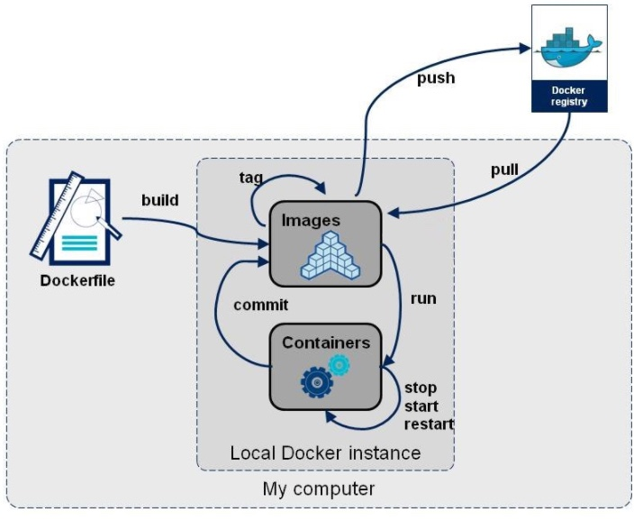
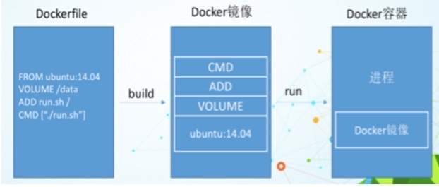
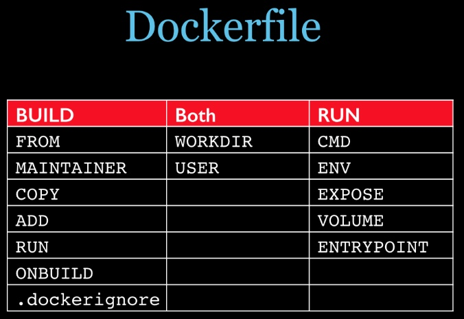

# 10. Dockerfile

## 1. 是什么？
Dockerfile是用来构建Docker镜像的文本文件，是由一条条构建镜像所需的指令和参数构成的脚本。



* Official Document: https://docs.docker.com/engine/reference/builder/

构建三步骤
1. 编写Dockerfile文件
2. docker build命令构建镜像
3. docker run依照镜像运行容器实例


## 2. Dockerfile构建过程解析
### 2.1 Dockerfile内容基础知识
1. 每条保留字指令都**必须为大写字母**且后面要跟随至少一个参数
2. 指令按照从上到下，顺序执行
3. #表示注释
4. 每条指令都会创建一个新的镜像层并对镜像进行提交

### 2.2 Docker执行Dockerfile的大致流程
1. docker从基础镜像运行一个容器
2. 执行一条指令并对容器做出修改
3. 执行类似`docker commit`的操作提交一个新的镜像层
4. docker再基于刚提交的镜像运行一个新的容器
5. 执行dockerfile种的下一条指令直到所有的指令都执行完成

### 2.3 小总结
从应用软件的角度来看，Dockerfile、Docker镜像与Docker容器分别代表软件的三个不同阶段：
* Dockerfile是软件的原料
* Docker镜像是软件的叫付品
* Docker容器则可以认为是软件镜像的运行态，也即依照镜像运行的容器实例

Dockerfile面向开发，Docker镜像成为交付标准，Docker容器则涉及部署与运维，三者缺一不可，合力充当Docker体系的基石。



1. Dockerfile，需要定义一个Dockerfile，Dockerfile定义了进程需要的一切东西。Dockerfile涉及的内容包括执行代码或者是文件、环境变量、依赖包、运行时环境、动态链接库、操作系统的发行版、服务进程和内核进程(当应用进程需要和系统服务和内核进程打交道，这时需要考虑如何设计namespace的权限控制)等等;
2. Docker镜像，在用Dockerfile定义一个文件之后，docker build时会产生一个Docker镜像，当运行 Docker镜像时会真正开始提供服务;
3. Docker容器，容器是直接提供服务的。


## 3. DockerFile常用保留字指令
参考tomcat8的Dockerfilerumen：https://github.com/docker-library/tomcat
参考：https://github.com/docker-library/tomcat/blob/master/Dockerfile.template

* `FROM`: 基础镜像，当前新镜像是基于哪个镜像的，指定一个已经存在的镜像作为模板。
* `MAINTAINER`: 镜像维护者的姓名和邮箱地址。
* `RUN`: 容器构建时需要运行的命令。有两种格式
    1. shell格式: `RUN <命令行命令>`，`<命令行命令>`等同于，在终端操作的shell命令。`RUN yum -y install vim`
    2. exec格式: `RUN ["可执行文件", "参数1", "参数2"]`，例如 `["./test.php", "dev", "offline"]`等价于`RUN ./test.php dev offline`
    3. RUN是在docker build时运行
* `EXPOSE`: 当前容器对外暴露出的端口
* `WORKDIR`: 指定在容器创建后，终端默认登陆后的工作目录，一个落脚点
* `USER`: 指定该镜像以什么样的用户去执行，如果都不指定，默认是root
* `ENV`: 用来在构建镜像过程中的设置环境变量
    * `ENV MY_PATH /usr/mytest`，这个环境变量可以在后续的任何RUN指令中使用，这就如同在命令前面指定了环境变量前缀一样；也可以在其它指令中直接使用这些环境变量，比如`WORKER $MY_PATH`
* `ADD`: 将宿主机目录下的文件拷贝进镜像且会自动处理URL和解压tar压缩包
* `COPY`: 类似ADD，拷贝文件和目录到镜像中，将从构建上下文目录中`<源路径>`的文件/目录复制到新的一层的镜像内的`<目标路径>`位置
    * `COPY src dest`
    * `COPY ["src", "dest"]`
    * `<src>`: 源文件or源目录
    * `<dest>`: 容器内的指定路径，该路径不用事先建好，路径不存在的话，会自动创建
* `VOLUME`: 容器数据卷，用于数据保存和持久化工作
* `CMD`: 指定容器启动后要干的事情
    * Dockerfile中可以有多个CMD指令，但只有最后一个生效，CMD会被docker run之后的参数替换
    * 参考官网Tomcat的dockerfile演示讲解：
        * 官网最后一行命令：`CMD ["catalina.sh", "run"]`
        * 演示自己的覆盖操作: `docker run -it -p 8080:8080 <Image ID> /bin/bash`
    * 它和前面RUN命令的区别：
        * CMD是在docker run时运行。
        * RUN是在docker build时运行。
* `ENTRYPOINT`: 用来指定一个容器启动时需要运行的命令。类似于CMD指令，但是ENTRYPOINT不会被docker run后面的命令覆盖，而且这些命令参数会被当作参数送给ENTRYPOINT指令指定的程序

命令格式：`ENTRYPOINT ["<executable>", "<param1>", "<param2>"]`
ENTRYPOINT可以和CMD一起用，一般是变参才会使用 CMD ，这里的 CMD 等于是在给 ENTRYPOINT 传参。
当指定了ENTRYPOINT后，CMD的含义就发生了变化，不再是直接运行其命令而是将CMD的内容作为参数传递给ENTRYPOINT指令，他两个组合会变成 `ENTRYPOINT "<CMD>"`

案例如下：假设已通过 Dockerfile 构建了 nginx:test 镜像：
```shell
FROM nginx

ENTRYPOINT ["nginx", "-c"]      # 定参
CMD ["/etc/nginx/nginx.conf"]   # 变参
```

| 是否传参     | 按照dockerfile编写执行               | 传参运行                                         |
| -------- | ------------------------------ | -------------------------------------------- |
| Docker命令 | docker run nginx:test          | docker run nginx:test -c /etc/nginx/new.conf |
| 衍生出的实际命令 | nginx -c /etc/nginx/nginx.conf | nginx -c /etc/nginx/new.conf                 |

优点：在执行docker run的时候可以指定 ENTRYPOINT 运行所需的参数。
注意：如果 Dockerfile 中如果存在多个 ENTRYPOINT 指令，仅最后一个生效。


## 4. 案例
### 1. 自定义镜像mycentos
要求：
1. CentOS7镜像具备vim+ifconfig+jdk8
2. JDK的下载镜像
    * https://www.oracle.com/java/technologies/downloads/#java8
    * https://mirrors.yangxingzhen.com/jdk/

编写`Dockerfile`文件：
```shell
FROM centos
MAINTAINER zzyy<zzyybs@126.com>

ENV MYPATH /usr/local
WORKDIR $MYPATH

RUN cd /etc/yum.repos.d/
RUN sed -i 's/mirrorlist/#mirrorlist/g' /etc/yum.repos.d/CentOS-*
RUN sed -i 's|#baseurl=http://mirror.centos.org|baseurl=http://vault.centos.org|g' /etc/yum.repos.d/CentOS-*
#安装vim编辑器
RUN yum -y install vim
#安装ifconfig命令查看网络IP
RUN yum -y install net-tools
#安装java8及lib库
RUN yum -y install glibc.i686
RUN mkdir /usr/local/java
#ADD 是相对路径jar,把jdk-8u171-linux-x64.tar.gz添加到容器中,安装包必须要和Dockerfile文件在同一位置
ADD jdk-8u381-linux-x64.tar.gz /usr/local/java/
#配置java环境变量
ENV JAVA_HOME /usr/local/java/jdk1.8.0_381
ENV JRE_HOME $JAVA_HOME/jre
ENV CLASSPATH $JAVA_HOME/lib/dt.jar:$JAVA_HOME/lib/tools.jar:$JRE_HOME/lib:$CLASSPATH
ENV PATH $JAVA_HOME/bin:$PATH

EXPOSE 80

CMD echo $MYPATH
CMD echo "success--------------ok"
CMD /bin/bash
```

构建
```shell
docker built -t 新镜像名字:TAG .    # 注意，TAG后面有个空格，然后还有个“."
docker build -t ubuntujava8:0.1 .
docker build -t centosjava8:0.1 .

➜  myfile git:(Docker) ✗ docker build -t centosjava8:0.1 .
[+] Building 21.3s (15/15) FINISHED                                                                           docker:desktop-linux
 => [internal] load .dockerignore                                                                                             0.0s
 => => transferring context: 2B                                                                                               0.0s
 => [internal] load build definition from Dockerfile                                                                          0.0s
 => => transferring dockerfile: 1.01kB                                                                                        0.0s
 => [internal] load metadata for docker.io/library/centos:latest                                                              0.0s
 => [ 1/10] FROM docker.io/library/centos                                                                                     0.0s
 => [internal] load build context                                                                                             0.0s
 => => transferring context: 420B                                                                                             0.0s
 => CACHED [ 2/10] WORKDIR /usr/local                                                                                         0.0s
 => [ 3/10] RUN cd /etc/yum.repos.d/                                                                                          0.1s
 => [ 4/10] RUN sed -i 's/mirrorlist/#mirrorlist/g' /etc/yum.repos.d/CentOS-*                                                 0.3s
 => [ 5/10] RUN sed -i 's|#baseurl=http://mirror.centos.org|baseurl=http://vault.centos.org|g' /etc/yum.repos.d/CentOS-*      0.2s
 => [ 6/10] RUN yum -y install vim                                                                                            9.3s
 => [ 7/10] RUN yum -y install net-tools                                                                                      1.6s
 => [ 8/10] RUN yum -y install glibc.i686                                                                                     3.9s 
 => [ 9/10] RUN mkdir /usr/local/java                                                                                         0.3s 
 => [10/10] ADD jdk-8u381-linux-x64.tar.gz /usr/local/java/                                                                   3.9s 
 => exporting to image                                                                                                        1.8s 
 => => exporting layers                                                                                                       1.8s 
 => => writing image sha256:6ed5468aad2eb6d1746387de6bc8b90bf7844cb17a95af60b928a1b75602f7b8                                  0.0s 
 => => naming to docker.io/library/centosjava8:0.1                                                                            0.0s 

What's Next?
  View summary of image vulnerabilities and recommendations → docker scout quickview
➜  myfile git:(Docker) ✗ 
```

运行：
```shell
docker run -it 新镜像名字:TAG

docker run -it centos /bin/bash
docker run -it centosjava8:0.1 /bin/bash

pwd

vim test.txt

ifconfig

java -version
```

### 2. 虚悬镜像
#### 2.1 是什么？
仓库名和标签都是`none`的镜像，俗称dangling image
```shell
docker images

➜  DanglingImage git:(Docker) ✗ docker image ls -f dangling=true 
REPOSITORY   TAG       IMAGE ID       CREATED       SIZE
<none>       <none>    b978a0945e7f   8 weeks ago   77.8MB

docker image prune
```

Dockerfile写一个虚悬镜像
```shell
# Dockerfile
FROM ubuntu
CMD echo 'action is success'
```
and then 
```shell
docker build .
```

#### 2.2 查看 & 删除
```shell
docker image ls -f dangling=true

docker image prune  
```
虚悬镜像已经失去存在的价值，可以删除。


### 3. 家庭作业--自定义镜像myubuntu
以下是Dockerfile
```shell
FROM ubuntu
MAINTAINER zzyy<zzyybs@126.com>
 
ENV MYPATH /usr/local
WORKDIR $MYPATH
 
RUN apt-get update
RUN apt-get install net-tools
#RUN apt-get install -y iproute2
#RUN apt-get install -y inetutils-ping
 
EXPOSE 80
 
CMD echo $MYPATH
CMD echo "install inconfig cmd into ubuntu success--------------ok"
CMD /bin/bash
```


## 5. 小总结

