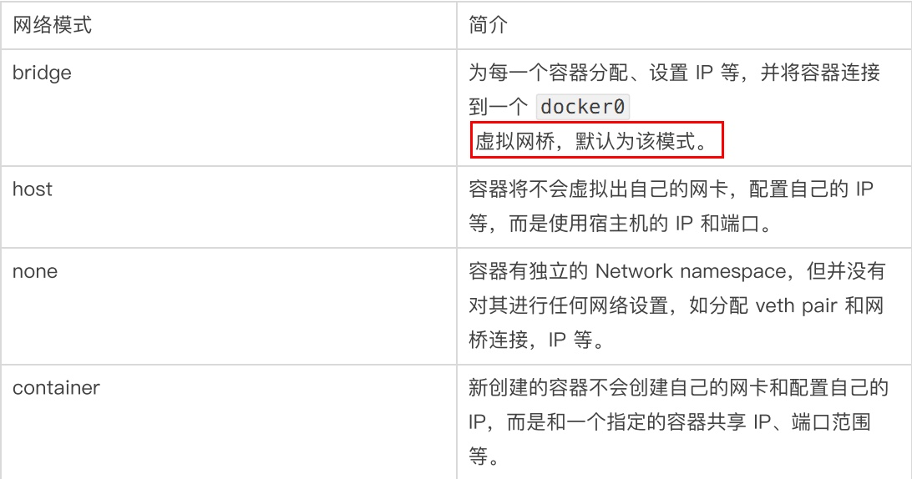
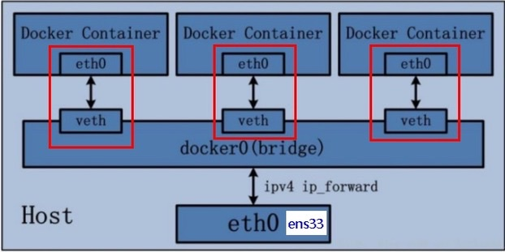
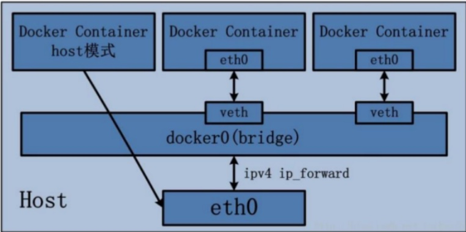
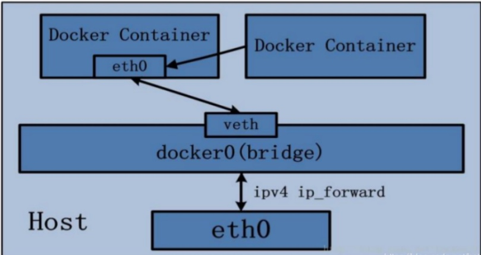
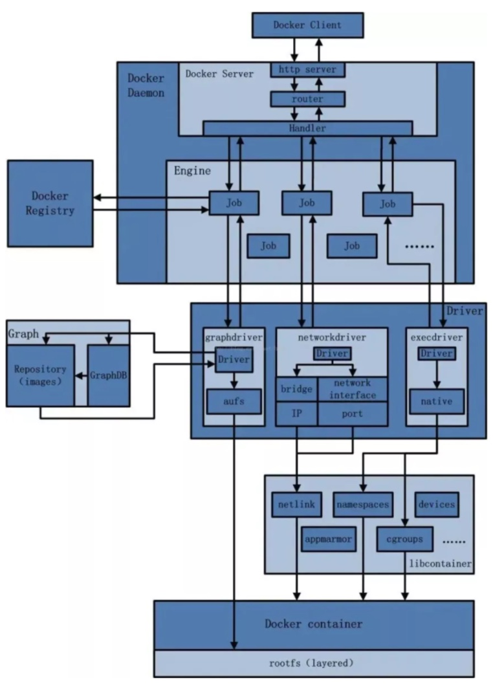

# 12. Docker网络

## 1. 是什么？
分别在Docker启动与不启动时，通过`ifconfig`命令查看网络情况
```shell
ifconfig
ifconfig | grep "inet " | grep -v 127.0.0.1

docker network ls
```

```shell
➜  ~ ifconfig
lo0: flags=8049<UP,LOOPBACK,RUNNING,MULTICAST> mtu 16384
	options=1203<RXCSUM,TXCSUM,TXSTATUS,SW_TIMESTAMP>
	inet 127.0.0.1 netmask 0xff000000
	inet6 ::1 prefixlen 128
	inet6 fe80::1%lo0 prefixlen 64 scopeid 0x1
	nd6 options=201<PERFORMNUD,DAD>
gif0: flags=8010<POINTOPOINT,MULTICAST> mtu 1280
stf0: flags=0<> mtu 1280
en1: flags=8863<UP,BROADCAST,SMART,RUNNING,SIMPLEX,MULTICAST> mtu 1500
	options=400<CHANNEL_IO>
	ether b8:09:8a:50:fd:42
	inet6 fe80::1c7e:6caa:47db:7d0b%en1 prefixlen 64 secured scopeid 0x4
	inet 192.168.68.61 netmask 0xfffffc00 broadcast 192.168.71.255
	inet6 2603:8000:4301:a0f::1008 prefixlen 128 dynamic
	inet6 fdfe:dbb5:67aa:4bd8:188f:fc76:9827:c84c prefixlen 64 autoconf secured
	nd6 options=201<PERFORMNUD,DAD>
	media: autoselect
	status: active
awdl0: flags=8843<UP,BROADCAST,RUNNING,SIMPLEX,MULTICAST> mtu 1484
	options=400<CHANNEL_IO>
	ether 42:7d:a9:78:4c:d3
	inet6 fe80::407d:a9ff:fe78:4cd3%awdl0 prefixlen 64 scopeid 0x5
	nd6 options=201<PERFORMNUD,DAD>
	media: autoselect
	status: active
llw0: flags=8863<UP,BROADCAST,SMART,RUNNING,SIMPLEX,MULTICAST> mtu 1500
	options=400<CHANNEL_IO>
	ether 42:7d:a9:78:4c:d3
	inet6 fe80::407d:a9ff:fe78:4cd3%llw0 prefixlen 64 scopeid 0x6
	nd6 options=201<PERFORMNUD,DAD>
	media: autoselect
	status: active
en0: flags=8863<UP,BROADCAST,SMART,RUNNING,SIMPLEX,MULTICAST> mtu 1500
	options=40b<RXCSUM,TXCSUM,VLAN_HWTAGGING,CHANNEL_IO>
	ether c8:7f:54:66:e6:2f
	nd6 options=201<PERFORMNUD,DAD>
	media: autoselect (<unknown type>)
	status: inactive
utun0: flags=8051<UP,POINTOPOINT,RUNNING,MULTICAST> mtu 1380
	inet6 fe80::f703:1ff8:ddd3:112b%utun0 prefixlen 64 scopeid 0x8
	nd6 options=201<PERFORMNUD,DAD>
utun1: flags=8051<UP,POINTOPOINT,RUNNING,MULTICAST> mtu 2000
	inet6 fe80::5f59:c168:f505:e358%utun1 prefixlen 64 scopeid 0x9
	nd6 options=201<PERFORMNUD,DAD>
utun2: flags=8051<UP,POINTOPOINT,RUNNING,MULTICAST> mtu 1000
	inet6 fe80::ce81:b1c:bd2c:69e%utun2 prefixlen 64 scopeid 0xa
	nd6 options=201<PERFORMNUD,DAD>
utun3: flags=8051<UP,POINTOPOINT,RUNNING,MULTICAST> mtu 1380
	inet6 fe80::5a0b:91cf:c95e:139b%utun3 prefixlen 64 scopeid 0xb
	nd6 options=201<PERFORMNUD,DAD>
utun4: flags=8051<UP,POINTOPOINT,RUNNING,MULTICAST> mtu 1380
	inet6 fe80::ec37:bcea:fa03:3a0%utun4 prefixlen 64 scopeid 0xc
	nd6 options=201<PERFORMNUD,DAD>
➜  ~ docker network ls
NETWORK ID     NAME      DRIVER    SCOPE
904c64d7c513   bridge    bridge    local
a548a9079b72   host      host      local
f8c14a170a4f   none      null      local
➜  ~
```


## 2. 常用基本命令
### 1. All命令
```shell
docker network --help
```

### 2. 查看网络
```shell
docker network ls

➜  ~ docker network ls
NETWORK ID     NAME      DRIVER    SCOPE
904c64d7c513   bridge    bridge    local
a548a9079b72   host      host      local
f8c14a170a4f   none      null      local
```

### 3. 查看网络源数据
```shell
docker network inspect <网络名字>

➜  ~ docker network inspect bridge
[
    {
        "Name": "bridge",
        "Id": "904c64d7c51330fc00bdcfd5a3bc624d5e39ed81ff599a10672e2a38af21edfb",
        "Created": "2023-08-30T02:11:10.179717693Z",
        "Scope": "local",
        "Driver": "bridge",
        "EnableIPv6": false,
        "IPAM": {
            "Driver": "default",
            "Options": null,
            "Config": [
                {
                    "Subnet": "172.17.0.0/16",
                    "Gateway": "172.17.0.1"
                }
            ]
        },
        "Internal": false,
        "Attachable": false,
        "Ingress": false,
        "ConfigFrom": {
            "Network": ""
        },
        "ConfigOnly": false,
        "Containers": {
            "0d7c7ed1367eb3f697c68049182780b45eba309bc51abc6e6bdeea314acae99a": {
                "Name": "u1",
                "EndpointID": "edd1499bccecdc4390daf66c61b368a4a82b16d118e1d3305c5d406c47904766",
                "MacAddress": "02:42:ac:11:00:02",
                "IPv4Address": "172.17.0.2/16",
                "IPv6Address": ""
            },
            "12f99fe85bb47fd8acd4a5ebc13d69bbbe81cbe99788cc49b2434cf76c2f9770": {
                "Name": "u3",
                "EndpointID": "cfca65961ec0a678b3e7c50a60b693740be7b98111483be22ee8cecd577a6338",
                "MacAddress": "02:42:ac:11:00:03",
                "IPv4Address": "172.17.0.3/16",
                "IPv6Address": ""
            }
        },
        "Options": {
            "com.docker.network.bridge.default_bridge": "true",
            "com.docker.network.bridge.enable_icc": "true",
            "com.docker.network.bridge.enable_ip_masquerade": "true",
            "com.docker.network.bridge.host_binding_ipv4": "0.0.0.0",
            "com.docker.network.bridge.name": "docker0",
            "com.docker.network.driver.mtu": "65535"
        },
        "Labels": {}
    }
]
➜  ~
```
* `"Driver": "bridge"`: 启动类型是`bridge`
* `"com.docker.network.bridge.name": "docker0"`: 名字是`docker0` (但是我并没有像在课程中看到的那样看到docker0)

### 4. 删除网络
```shell
docker network rm <网络名字>
```

**案例**
```shell
➜  ~ docker network create aaa_network
fef482b3610927c621177e4af673adfee30c2dbc47b484d61170715b2acadef6
➜  ~ docker network ls
NETWORK ID     NAME          DRIVER    SCOPE
fef482b36109   aaa_network   bridge    local
904c64d7c513   bridge        bridge    local
a548a9079b72   host          host      local
f8c14a170a4f   none          null      local
➜  ~     
➜  ~ docker network rm aaa_network
aaa_network
➜  ~ docker network ls
NETWORK ID     NAME      DRIVER    SCOPE
904c64d7c513   bridge    bridge    local
a548a9079b72   host      host      local
f8c14a170a4f   none      null      local
➜  ~ 
```


## 3. 能干嘛？
所有网络能够访问的前提：同一网段。在单机版的Docker容器实例中，网络问题并不明显。

在实际开发中，是需要做Docker网络管理和容器调用之间的规划。此时就需要考虑是要用bridge还是host模式等等。

1. 容器间的互联和通信，以及端口映射
2. 容器IP变动时候可以通过服务名直接网络通信，而不受IP地址变动的影响


## 4. 网络模式
### 1. 总体介绍
1. `bridge`模式：使用`--network  bridge`指定，默认使用`docker0` (在MacOS上通过ifconfig命令并为看到docker0)
2. `host`模式：使用`--network host`指定
3. `none`模式：使用`--network none`指定, almost never used in practice
4. `container`模式：使用`--network container:NAME或者容器ID`指定




### 2. 容器实例内默认网络IP生产规则
#### 2.1 说明
1. 先启动两个ubuntu容器实例
2. `docker inspect <容器ID or 容器名字>`
3. 关闭u2实例，新建u3，查看ip变化
```shell
➜  ~ docker run -it --name u1 ubuntu bash  # 然后Ctrl+P and Ctrl+Q, the shell session ends, but the container continues to run in the background
➜  ~ docker run -it --name u2 ubuntu bash
➜  ~ docker ps
CONTAINER ID   IMAGE     COMMAND   CREATED          STATUS          PORTS     NAMES
c8e298f70a55   ubuntu    "bash"    6 seconds ago    Up 5 seconds              u2
8fbb688a30a0   ubuntu    "bash"    27 minutes ago   Up 27 minutes             u1
```
* 此时u1，u2都有自己的网络IP，可以通过`docker inspect`命令查看
```shell
docker inspect u1
docker inspect u1 | tail -n 20

➜  ~ docker inspect u1 | tail -n 20
            "Networks": {
                "bridge": {
                    "IPAMConfig": null,
                    "Links": null,
                    "Aliases": null,
                    "NetworkID": "904c64d7c51330fc00bdcfd5a3bc624d5e39ed81ff599a10672e2a38af21edfb",
                    "EndpointID": "8c0e25c3c237a71e450e25037e753331ce58a6965d6629139eb4a515da8a4a0f",
                    "Gateway": "172.17.0.1",
                    "IPAddress": "172.17.0.2",
                    "IPPrefixLen": 16,
                    "IPv6Gateway": "",
                    "GlobalIPv6Address": "",
                    "GlobalIPv6PrefixLen": 0,
                    "MacAddress": "02:42:ac:11:00:02",
                    "DriverOpts": null
                }
            }
        }
    }
]
➜  ~
➜  ~ docker inspect u2 | tail -n 20
            "Networks": {
                "bridge": {
                    "IPAMConfig": null,
                    "Links": null,
                    "Aliases": null,
                    "NetworkID": "904c64d7c51330fc00bdcfd5a3bc624d5e39ed81ff599a10672e2a38af21edfb",
                    "EndpointID": "2ddc589b062a0de305a6731ab85bdd368596a7e5e2eeef490b19535bd8f75956",
                    "Gateway": "172.17.0.1",
                    "IPAddress": "172.17.0.3",
                    "IPPrefixLen": 16,
                    "IPv6Gateway": "",
                    "GlobalIPv6Address": "",
                    "GlobalIPv6PrefixLen": 0,
                    "MacAddress": "02:42:ac:11:00:03",
                    "DriverOpts": null
                }
            }
        }
    }
]
➜  ~
```
* u1的网络是bridge网络，网关是`172.17.0.1`, IP是`172.17.0.2`
* u2的网络是bridge网络，网关是`172.17.0.1`, IP是`172.17.0.3`

关闭u2实例，新建u3，查看ip变化
```shell
➜  ~ docker rm -f u2
➜  ~ docker run -it --name u3 ubuntu bash
root@70e689fac86d:/# %
➜  ~
➜  ~ docker inspect u3 | tail -n 20
            "Networks": {
                "bridge": {
                    "IPAMConfig": null,
                    "Links": null,
                    "Aliases": null,
                    "NetworkID": "904c64d7c51330fc00bdcfd5a3bc624d5e39ed81ff599a10672e2a38af21edfb",
                    "EndpointID": "dd8d4d4b6263e97ff241c1c4128156ee96a5fa6b6f7ef4d9a3d842e33facbc1d",
                    "Gateway": "172.17.0.1",
                    "IPAddress": "172.17.0.3",
                    "IPPrefixLen": 16,
                    "IPv6Gateway": "",
                    "GlobalIPv6Address": "",
                    "GlobalIPv6PrefixLen": 0,
                    "MacAddress": "02:42:ac:11:00:03",
                    "DriverOpts": null
                }
            }
        }
    }
]
➜  ~
```
* 同一个IP `172.17.0.3`先后分配个u2，u3，说明底层的网络是可能发生变动的。也即是，容器内部的IP是可以发生变动的，所以需要写好网络管理。

#### 2.2 结论
Docker容器内部的IP是有可能发生改变的

### 3. 案例说明
#### 3.1 bridge
##### 是什么？
Docker服务默认会创建一个`docker0`网桥(其上会有一个docker0内部接口)，该桥接网络的名称为`docker0`, 它在**内核层**连通了其它的物理或虚拟网卡，这就是将所有容器和本地主机都放到**同一个物理网络**。Docker默认指定了`docker0`接口的IP地址和子网掩码，**让主机和容器之间可以通过网桥互相通信**。

```shell
➜  ~ docker network inspect bridge
[
    {
        "Name": "bridge",
        "Id": "904c64d7c51330fc00bdcfd5a3bc624d5e39ed81ff599a10672e2a38af21edfb",
        "Created": "2023-08-30T02:11:10.179717693Z",
        "Scope": "local",
        "Driver": "bridge",
        "EnableIPv6": false,
        "IPAM": {
            "Driver": "default",
            "Options": null,
            "Config": [
                {
                    "Subnet": "172.17.0.0/16",
                    "Gateway": "172.17.0.1"
                }
            ]
        },
        "Internal": false,
        "Attachable": false,
        "Ingress": false,
        "ConfigFrom": {
            "Network": ""
        },
        "ConfigOnly": false,
        "Containers": {
            "70e689fac86d618e2a6390adb02e37c8b317b0d9a8647c74b7a734317210d727": {
                "Name": "u3",
                "EndpointID": "dd8d4d4b6263e97ff241c1c4128156ee96a5fa6b6f7ef4d9a3d842e33facbc1d",
                "MacAddress": "02:42:ac:11:00:03",
                "IPv4Address": "172.17.0.3/16",
                "IPv6Address": ""
            },
            "8fbb688a30a0963378197fba3932c27dd2dcd4047e18b58e77dd277f5cf7ccde": {
                "Name": "u1",
                "EndpointID": "8c0e25c3c237a71e450e25037e753331ce58a6965d6629139eb4a515da8a4a0f",
                "MacAddress": "02:42:ac:11:00:02",
                "IPv4Address": "172.17.0.2/16",
                "IPv6Address": ""
            }
        },
        "Options": {
            "com.docker.network.bridge.default_bridge": "true",
            "com.docker.network.bridge.enable_icc": "true",
            "com.docker.network.bridge.enable_ip_masquerade": "true",
            "com.docker.network.bridge.host_binding_ipv4": "0.0.0.0",
            "com.docker.network.bridge.name": "docker0",
            "com.docker.network.driver.mtu": "65535"
        },
        "Labels": {}
    }
]
➜  ~
➜  ~ docker network inspect bridge | grep name
            "com.docker.network.bridge.name": "docker0",
➜  ~
➜  ~ ifconfig | grep docker    # Nothing in MacOS ???
```
* 最常用的就是bridge

##### 案例
**说明**
1. Docker使用Linux桥接，在宿主机虚拟一个Docker容器网桥(`docker0`)，Docker启动一个容器时会根据Docker网桥的网段分配给容器一个IP地址，称为Container-IP，同时Docker网桥是每个容器的默认网关。因为在同一宿主机内的容器都接入同一个网桥，这样容器之间就能够通过容器的Container-IP直接通信。(比如u1, u2, u3中的`172.17.0.1`就是Container-IP)
2. `docker run`的时候，没有指定network的话默认使用的网桥模式就是`bridge`，使用的就是`docker0`。在宿主机`ifconfig`,就可以看到`docker0`和自己create的network(后面讲)eth0，eth1，eth2……代表网卡一，网卡二，网卡三…… ，lo代表127.0.0.1，即localhost ，`inet addr`用来表示网卡的IP地址
3. 网桥`docker0`创建一对对等虚拟设备接口一个叫`veth`，另一个叫`eth0`，成对匹配。
    1. 整个宿主机的网桥模式都是docker0，类似一个交换机有一堆接口，每个接口叫veth，在本地主机和容器内分别创建一个虚拟接口，并让他们彼此联通（这样一对接口叫veth pair）；
    2. 每个容器实例内部也有一块网卡，每个接口叫eth0；
    3. docker0上面的每个veth匹配某个容器实例内部的eth0，两两配对，一一匹配。  

    通过上述，将宿主机上的所有容器都连接到这个内部网络上，两个容器在同一个网络下,会从这个网关下各自拿到分配的ip，此时两个容器的网络是互通的。




```shell
➜  ~ docker run -d -p 8081:8080   --name tomcat81 billygoo/tomcat8-jdk8
➜  ~ docker run -d -p 8082:8080   --name tomcat82 billygoo/tomcat8-jdk8
➜  ~ docker ps
CONTAINER ID   IMAGE                   COMMAND             CREATED          STATUS          PORTS                    NAMES
f94a102b929d   billygoo/tomcat8-jdk8   "catalina.sh run"   25 seconds ago   Up 25 seconds   0.0.0.0:8082->8080/tcp   tomcat82
6395903fc021   billygoo/tomcat8-jdk8   "catalina.sh run"   36 seconds ago   Up 35 seconds   0.0.0.0:8081->8080/tcp   tomcat81

➜  ~ docker exec -it tomcat81 bash
root@6395903fc021:/usr/local/tomcat# ip addr
1: lo: <LOOPBACK,UP,LOWER_UP> mtu 65536 qdisc noqueue state UNKNOWN group default qlen 1000
    link/loopback 00:00:00:00:00:00 brd 00:00:00:00:00:00
    inet 127.0.0.1/8 scope host lo
       valid_lft forever preferred_lft forever
2: tunl0@NONE: <NOARP> mtu 1480 qdisc noop state DOWN group default qlen 1000
    link/ipip 0.0.0.0 brd 0.0.0.0
3: ip6tnl0@NONE: <NOARP> mtu 1452 qdisc noop state DOWN group default qlen 1000
    link/tunnel6 :: brd ::
33: eth0@if34: <BROADCAST,MULTICAST,UP,LOWER_UP> mtu 65535 qdisc noqueue state UP group default
    link/ether 02:42:ac:11:00:04 brd ff:ff:ff:ff:ff:ff link-netnsid 0
    inet 172.17.0.4/16 brd 172.17.255.255 scope global eth0
       valid_lft forever preferred_lft forever
root@6395903fc021:/usr/local/tomcat#

➜  ~ docker exec -it tomcat82 bash
root@f94a102b929d:/usr/local/tomcat# ip addr
1: lo: <LOOPBACK,UP,LOWER_UP> mtu 65536 qdisc noqueue state UNKNOWN group default qlen 1000
    link/loopback 00:00:00:00:00:00 brd 00:00:00:00:00:00
    inet 127.0.0.1/8 scope host lo
       valid_lft forever preferred_lft forever
2: tunl0@NONE: <NOARP> mtu 1480 qdisc noop state DOWN group default qlen 1000
    link/ipip 0.0.0.0 brd 0.0.0.0
3: ip6tnl0@NONE: <NOARP> mtu 1452 qdisc noop state DOWN group default qlen 1000
    link/tunnel6 :: brd ::
35: eth0@if36: <BROADCAST,MULTICAST,UP,LOWER_UP> mtu 65535 qdisc noqueue state UP group default
    link/ether 02:42:ac:11:00:05 brd ff:ff:ff:ff:ff:ff link-netnsid 0
    inet 172.17.0.5/16 brd 172.17.255.255 scope global eth0
       valid_lft forever preferred_lft forever
root@f94a102b929d:/usr/local/tomcat#
```
* Docker内部的网络是`eth0`
* 宿主机上对应的是`veth` (无法在MacOS上验证)

然后进行两两匹配验证: `veth`(宿主机上) ~ `eth0`(容器内部)


#### 3.2 host
##### 是什么？
直接使用宿主机的IP地址与外界进行通信，不再需要额外进行NAT转换。

```shell
➜  ~ docker network inspect host
[
    {
        "Name": "host",
        "Id": "a548a9079b72ca3bde099314e98d892e46b25221c44162dc910c56b648ec018b",
        "Created": "2023-08-02T05:37:32.93905026Z",
        "Scope": "local",
        "Driver": "host",
        "EnableIPv6": false,
        "IPAM": {
            "Driver": "default",
            "Options": null,
            "Config": []
        },
        "Internal": false,
        "Attachable": false,
        "Ingress": false,
        "ConfigFrom": {
            "Network": ""
        },
        "ConfigOnly": false,
        "Containers": {},
        "Options": {},
        "Labels": {}
    }
]
➜  ~
```

##### 说明
容器将不会获得一个一个独立的Network Namespace，而是和宿主机共用一个Network Namespace。**容器将不会虚拟出自己的网卡而是使用宿主机的IP和端口。**



##### 代码
⚠️**警告**
```shell
➜  ~ docker run -d -p 8083:8080 --network host --name tomcat83 billygoo/tomcat8-jdk8
WARNING: Published ports are discarded when using host network mode
f9ccda2194cdbac73a80e08fd0a2bf3c7b86d2c0280c9cd19b1cd6b9deda22fd
➜  ~
```
* 问题：上述命令启动时，总是遇见标题中的警告。
* 原因：docker启动时，指定`--network host`或`-net=host`，如果还指定了`-p`映射端口，那这个时候就会有此警告，并且通过`-p`设置的参数将不会起到任何作用，端口号会以主机端口号为主，重复时则递增。
* 解决：解决办法就是使用docker的其它模式，例如`--network=bridge`，这样就可以解决问题，或者直接无视

**正确**
```shell
➜  ~ docker run -d --network host --name tomcat83 billygoo/tomcat8-jdk8
ee51edfca69ced861b4a81b6d663ab5d5ff2773b5fa64061e0faf52c0bbdc081
➜  ~ docker ps
CONTAINER ID   IMAGE                   COMMAND             CREATED          STATUS          PORTS                    NAMES
ee51edfca69c   billygoo/tomcat8-jdk8   "catalina.sh run"   2 seconds ago    Up 2 seconds                             tomcat83
f94a102b929d   billygoo/tomcat8-jdk8   "catalina.sh run"   15 minutes ago   Up 15 minutes   0.0.0.0:8082->8080/tcp   tomcat82
6395903fc021   billygoo/tomcat8-jdk8   "catalina.sh run"   15 minutes ago   Up 15 minutes   0.0.0.0:8081->8080/tcp   tomcat81
➜  ~
```
* 在使用host模式时，无bridge中的配对显示了。看容器实例内部
* 没有像u1, u2那样的网口映射

```shell
➜  ~ docker inspect tomcat83 | tail -n 20
            "Networks": {
                "host": {
                    "IPAMConfig": null,
                    "Links": null,
                    "Aliases": null,
                    "NetworkID": "a548a9079b72ca3bde099314e98d892e46b25221c44162dc910c56b648ec018b",
                    "EndpointID": "4751252d3ef23528d4fa493f00e28e8c6abd31c2ce89cb30f8b5c782427e4b3e",
                    "Gateway": "",
                    "IPAddress": "",
                    "IPPrefixLen": 0,
                    "IPv6Gateway": "",
                    "GlobalIPv6Address": "",
                    "GlobalIPv6PrefixLen": 0,
                    "MacAddress": "",
                    "DriverOpts": null
                }
            }
        }
    }
]
➜  ~
```
* 此时模式是`host`
* `Gateway` & `IPAddress`都是“”，说明容器没有自己的网关和IP，而是和宿主机共用。

进入容器tomcat83后，查看ip信息，此时可以看到`docker0` (与宿主机(host)一致)
```shell
➜  ~ docker exec -it tomcat83 bash
root@docker-desktop:/usr/local/tomcat# ip addr
1: lo: <LOOPBACK,UP,LOWER_UP> mtu 65536 qdisc noqueue state UNKNOWN group default qlen 1000
    link/loopback 00:00:00:00:00:00 brd 00:00:00:00:00:00
    inet 127.0.0.1/8 scope host lo
       valid_lft forever preferred_lft forever
    inet6 ::1/128 scope host
       valid_lft forever preferred_lft forever
2: tunl0@NONE: <NOARP> mtu 1480 qdisc noop state DOWN group default qlen 1000
    link/ipip 0.0.0.0 brd 0.0.0.0
3: ip6tnl0@NONE: <NOARP> mtu 1452 qdisc noop state DOWN group default qlen 1000
    link/tunnel6 :: brd ::
4: docker0: <BROADCAST,MULTICAST,UP,LOWER_UP> mtu 65535 qdisc noqueue state UP group default
    link/ether 02:42:93:da:ab:27 brd ff:ff:ff:ff:ff:ff
    inet 172.17.0.1/16 brd 172.17.255.255 scope global docker0
       valid_lft forever preferred_lft forever
    inet6 fe80::42:93ff:feda:ab27/64 scope link
       valid_lft forever preferred_lft forever
8: eth0@if7: <BROADCAST,MULTICAST,UP,LOWER_UP> mtu 65535 qdisc noqueue state UP group default
    link/ether 1e:6b:56:62:e7:74 brd ff:ff:ff:ff:ff:ff link-netnsid 0
    inet 192.168.65.4 peer 192.168.65.5/32 scope global eth0
       valid_lft forever preferred_lft forever
    inet6 fe80::1c6b:56ff:fe62:e774/64 scope link
       valid_lft forever preferred_lft forever
32: br-d9449f9698cb: <NO-CARRIER,BROADCAST,MULTICAST,UP> mtu 1500 qdisc noqueue state DOWN group default
    link/ether 02:42:d8:56:1e:c0 brd ff:ff:ff:ff:ff:ff
    inet 172.20.0.1/16 brd 172.20.255.255 scope global br-d9449f9698cb
       valid_lft forever preferred_lft forever
34: vethe52266b@if33: <BROADCAST,MULTICAST,UP,LOWER_UP> mtu 65535 qdisc noqueue master docker0 state UP group default
    link/ether c6:74:ab:a0:92:a6 brd ff:ff:ff:ff:ff:ff link-netnsid 3
    inet6 fe80::c474:abff:fea0:92a6/64 scope link
       valid_lft forever preferred_lft forever
36: veth7ab65fa@if35: <BROADCAST,MULTICAST,UP,LOWER_UP> mtu 65535 qdisc noqueue master docker0 state UP group default
    link/ether da:5c:be:16:21:7e brd ff:ff:ff:ff:ff:ff link-netnsid 4
    inet6 fe80::d85c:beff:fe16:217e/64 scope link
       valid_lft forever preferred_lft forever
```

##### 

在CentOS里面用默认的火狐浏览器访问容器内的tomcat83看到访问成功，因为此时容器的IP借用主机的IP，所以容器共享宿主机的网络IP，这样的好吃是外部主机与容器可以直接通信。


#### 3.3 none
##### 是什么？
禁用网络功能，只有`lo`标识，就是`127.0.0.1`标识本地回环。

在none模式下，并部位Docker容器进行任何网络配置。也就是说，这个Docker容器没有网卡、IP、路由等信息，只有一个`lo`。
需要我们自己为Docker容器添加网卡、配置IP等。

##### 案例
```shell
➜  ~ docker run -d -p 8084:8080 --network none --name tomcat84 billygoo/tomcat8-jdk8
763ca943ea762eca1e648a8c051490b5751763b5603e8a73f371d494d898098b
➜  ~ docker ps
CONTAINER ID   IMAGE                   COMMAND             CREATED          STATUS          PORTS                    NAMES
763ca943ea76   billygoo/tomcat8-jdk8   "catalina.sh run"   4 seconds ago    Up 3 seconds                             tomcat84
ee51edfca69c   billygoo/tomcat8-jdk8   "catalina.sh run"   18 minutes ago   Up 18 minutes                            tomcat83
f94a102b929d   billygoo/tomcat8-jdk8   "catalina.sh run"   33 minutes ago   Up 33 minutes   0.0.0.0:8082->8080/tcp   tomcat82
6395903fc021   billygoo/tomcat8-jdk8   "catalina.sh run"   33 minutes ago   Up 33 minutes   0.0.0.0:8081->8080/tcp   tomcat81
➜  ~
➜  ~ docker inspect tomcat84 | tail -n 20
            "Networks": {
                "none": {
                    "IPAMConfig": null,
                    "Links": null,
                    "Aliases": null,
                    "NetworkID": "f8c14a170a4f3ecada6c48b7d0289c92e8c2bf0137d186c7f8d3c582efa32254",
                    "EndpointID": "7b1a577f2e0cbd251e646589853bec26c18cc9a2e7c4427a28d70b52fb11568e",
                    "Gateway": "",
                    "IPAddress": "",
                    "IPPrefixLen": 0,
                    "IPv6Gateway": "",
                    "GlobalIPv6Address": "",
                    "GlobalIPv6PrefixLen": 0,
                    "MacAddress": "",
                    "DriverOpts": null
                }
            }
        }
    }
]
➜  ~
➜  ~ docker exec -it tomcat84 bash
root@763ca943ea76:/usr/local/tomcat# ip addr
1: lo: <LOOPBACK,UP,LOWER_UP> mtu 65536 qdisc noqueue state UNKNOWN group default qlen 1000
    link/loopback 00:00:00:00:00:00 brd 00:00:00:00:00:00
    inet 127.0.0.1/8 scope host lo
       valid_lft forever preferred_lft forever
2: tunl0@NONE: <NOARP> mtu 1480 qdisc noop state DOWN group default qlen 1000
    link/ipip 0.0.0.0 brd 0.0.0.0
3: ip6tnl0@NONE: <NOARP> mtu 1452 qdisc noop state DOWN group default qlen 1000
    link/tunnel6 :: brd ::
root@763ca943ea76:/usr/local/tomcat#
```

```shell
➜  ~ docker network inspect none
[
    {
        "Name": "none",
        "Id": "f8c14a170a4f3ecada6c48b7d0289c92e8c2bf0137d186c7f8d3c582efa32254",
        "Created": "2023-08-02T05:37:32.926190655Z",
        "Scope": "local",
        "Driver": "null",
        "EnableIPv6": false,
        "IPAM": {
            "Driver": "default",
            "Options": null,
            "Config": []
        },
        "Internal": false,
        "Attachable": false,
        "Ingress": false,
        "ConfigFrom": {
            "Network": ""
        },
        "ConfigOnly": false,
        "Containers": {},
        "Options": {},
        "Labels": {}
    }
]
➜  ~
```


#### 3.4 container
##### 是什么？
新建的容器和已经存在的一个容器共享一个网络ip配置而不是和宿主机共享。新创建的容器不会创建自己的网卡，配置自己的IP，而是和一个指定的容器共享IP、端口范围等。同样，两个容器除了网络方面，其他的如文件系统、进程列表等还是隔离的。


##### :x: 案例1
```shell
➜  ~ docker run -d -p 8085:8080                              --name tomcat85 billygoo/tomcat8-jdk8
90201f7626f27beb3ce18aa7ec60b9967451a02da06d370f87c1cf5583aef7dd
➜  ~ docker ps
CONTAINER ID   IMAGE                   COMMAND             CREATED             STATUS             PORTS                    NAMES
90201f7626f2   billygoo/tomcat8-jdk8   "catalina.sh run"   2 seconds ago       Up 1 second        0.0.0.0:8085->8080/tcp   tomcat85
763ca943ea76   billygoo/tomcat8-jdk8   "catalina.sh run"   About an hour ago   Up About an hour                            tomcat84
ee51edfca69c   billygoo/tomcat8-jdk8   "catalina.sh run"   About an hour ago   Up About an hour                            tomcat83
f94a102b929d   billygoo/tomcat8-jdk8   "catalina.sh run"   2 hours ago         Up 2 hours         0.0.0.0:8082->8080/tcp   tomcat82
6395903fc021   billygoo/tomcat8-jdk8   "catalina.sh run"   2 hours ago         Up 2 hours         0.0.0.0:8081->8080/tcp   tomcat81
➜  ~ docker run -d -p 8086:8080 --network container:tomcat85 --name tomcat86 billygoo/tomcat8-jdk8
docker: Error response from daemon: conflicting options: port publishing and the container type network mode.
See 'docker run --help'.
➜  ~ 
```
* 相当于tomcat86和tomcat85共用同一个IP，同一个端口，导致端口冲突。本案例不适合用tomcat演示。

##### :white_check_mark: 案例2
**Alpine**: Alpine Linux 是一款独立的、非商业的通用 Linux 发行版，专为追求安全性、简单性和资源效率的用户而设计。 可能很多人没听说过这个 Linux 发行版本，但是经常用 Docker 的朋友可能都用过，因为他小，简单，安全而著称，所以作为基础镜像是非常好的一个选择，可谓是麻雀虽小但五脏俱全，镜像非常小巧，不到 6M的大小，所以特别适合容器打包。

```shell
➜  ~ docker run -it                             --name alpine1  alpine /bin/sh
Unable to find image 'alpine:latest' locally
latest: Pulling from library/alpine
7264a8db6415: Pull complete 
Digest: sha256:7144f7bab3d4c2648d7e59409f15ec52a18006a128c733fcff20d3a4a54ba44a
Status: Downloaded newer image for alpine:latest
/ # ip addr
1: lo: <LOOPBACK,UP,LOWER_UP> mtu 65536 qdisc noqueue state UNKNOWN qlen 1000
    link/loopback 00:00:00:00:00:00 brd 00:00:00:00:00:00
    inet 127.0.0.1/8 scope host lo
       valid_lft forever preferred_lft forever
2: tunl0@NONE: <NOARP> mtu 1480 qdisc noop state DOWN qlen 1000
    link/ipip 0.0.0.0 brd 0.0.0.0
3: ip6tnl0@NONE: <NOARP> mtu 1452 qdisc noop state DOWN qlen 1000
    link/tunnel6 00:00:00:00:00:00:00:00:00:00:00:00:00:00:00:00 brd 00:00:00:00:00:00:00:00:00:00:00:00:00:00:00:00
39: eth0@if40: <BROADCAST,MULTICAST,UP,LOWER_UP,M-DOWN> mtu 65535 qdisc noqueue state UP 
    link/ether 02:42:ac:11:00:03 brd ff:ff:ff:ff:ff:ff
    inet 172.17.0.3/16 brd 172.17.255.255 scope global eth0
       valid_lft forever preferred_lft forever
/ # 


➜  ~ docker run -it --network container:alpine1 --name alpine2  alpine /bin/sh
/ # ip addr
1: lo: <LOOPBACK,UP,LOWER_UP> mtu 65536 qdisc noqueue state UNKNOWN qlen 1000
    link/loopback 00:00:00:00:00:00 brd 00:00:00:00:00:00
    inet 127.0.0.1/8 scope host lo
       valid_lft forever preferred_lft forever
2: tunl0@NONE: <NOARP> mtu 1480 qdisc noop state DOWN qlen 1000
    link/ipip 0.0.0.0 brd 0.0.0.0
3: ip6tnl0@NONE: <NOARP> mtu 1452 qdisc noop state DOWN qlen 1000
    link/tunnel6 00:00:00:00:00:00:00:00:00:00:00:00:00:00:00:00 brd 00:00:00:00:00:00:00:00:00:00:00:00:00:00:00:00
39: eth0@if40: <BROADCAST,MULTICAST,UP,LOWER_UP,M-DOWN> mtu 65535 qdisc noqueue state UP 
    link/ether 02:42:ac:11:00:03 brd ff:ff:ff:ff:ff:ff
    inet 172.17.0.3/16 brd 172.17.255.255 scope global eth0
       valid_lft forever preferred_lft forever
/ # 
```
* `alpine2`使用与`alpine1`相同的IP：`39: eth0@if40`, `inet 172.17.0.3/16`

此时关闭`alpine1`，再看看`alpine2`
```shell
# In container alpine2
/ # ip addr
1: lo: <LOOPBACK,UP,LOWER_UP> mtu 65536 qdisc noqueue state UNKNOWN qlen 1000
    link/loopback 00:00:00:00:00:00 brd 00:00:00:00:00:00
    inet 127.0.0.1/8 scope host lo
       valid_lft forever preferred_lft forever
2: tunl0@NONE: <NOARP> mtu 1480 qdisc noop state DOWN qlen 1000
    link/ipip 0.0.0.0 brd 0.0.0.0
3: ip6tnl0@NONE: <NOARP> mtu 1452 qdisc noop state DOWN qlen 1000
    link/tunnel6 00:00:00:00:00:00:00:00:00:00:00:00:00:00:00:00 brd 00:00:00:00:00:00:00:00:00:00:00:00:00:00:00:00

```


#### 3.5 自定义网络
##### 过时的link

##### 是什么？
```shell
➜  ~ docker network inspect bb_network
[
    {
        "Name": "bb_network",
        "Id": "d9449f9698cbbb9650302227cac8d88a47ddd035bb86252a86c6e433d623bf8c",
        "Created": "2023-08-31T05:23:06.476244093Z",
        "Scope": "local",
        "Driver": "bridge",
        "EnableIPv6": false,
        "IPAM": {
            "Driver": "default",
            "Options": {},
            "Config": [
                {
                    "Subnet": "172.20.0.0/16",
                    "Gateway": "172.20.0.1"
                }
            ]
        },
        "Internal": false,
        "Attachable": false,
        "Ingress": false,
        "ConfigFrom": {
            "Network": ""
        },
        "ConfigOnly": false,
        "Containers": {},
        "Options": {},
        "Labels": {}
    }
]
➜  ~
```

##### 案例
**Before**
```shell
root@6395903fc021:/usr/local/tomcat# ping 127.17.0.5
PING 127.17.0.5 (127.17.0.5) 56(84) bytes of data.
64 bytes from 127.17.0.5: icmp_seq=1 ttl=64 time=0.044 ms
64 bytes from 127.17.0.5: icmp_seq=2 ttl=64 time=0.047 ms

root@6395903fc021:/usr/local/tomcat# ping tomcat82
ping: tomcat82: Name or service not known
```
* 在tomcat81中ping tomcat82的IP地址，是可以ping通的。
* 但是`pint tomcat82`则会报错

结论：
1. 按照IP地址ping是OK的
2. 按照服务名ping会报错


**After**

自定义桥接网络，自定义网络默认使用的是桥接网络bridge
1. 新建自定义网络
2. 新建容器加入上一步新建的自定义网络
3. 互相ping测试
```shell
➜  ~ docker network create test_network
4d10dd70d15948f7adb0a425cbc1a6fee2b4cd085e85a24d185bd92f2d5cf7a1
➜  ~ docker network ls
NETWORK ID     NAME           DRIVER    SCOPE
904c64d7c513   bridge         bridge    local
a548a9079b72   host           host      local
f8c14a170a4f   none           null      local
4d10dd70d159   test_network   bridge    local
➜  ~

➜  ~ docker run -d -p 8081:8080 --network test_network  --name tomcat81 billygoo/tomcat8-jdk8
eae05ff9c760ada9b026000d0a860a4dcbc08b8831f3010fe8298d650a64c653
➜  ~ docker run -d -p 8082:8080 --network test_network  --name tomcat82 billygoo/tomcat8-jdk8
b2afb8305881231de009edf7e08a132665935124a2ecb23277ed31c5b9d791ec
➜  ~ docker ps
CONTAINER ID   IMAGE                   COMMAND             CREATED         STATUS         PORTS                    NAMES
b2afb8305881   billygoo/tomcat8-jdk8   "catalina.sh run"   2 seconds ago   Up 1 second    0.0.0.0:8082->8080/tcp   tomcat82
eae05ff9c760   billygoo/tomcat8-jdk8   "catalina.sh run"   9 seconds ago   Up 9 seconds   0.0.0.0:8081->8080/tcp   tomcat81
➜  ~

➜  ~ docker exec -it tomcat81 bash
root@eae05ff9c760:/usr/local/tomcat# ping tomcat82
PING tomcat82 (172.21.0.3) 56(84) bytes of data.
64 bytes from tomcat82.test_network (172.21.0.3): icmp_seq=1 ttl=64 time=0.059 ms
64 bytes from tomcat82.test_network (172.21.0.3): icmp_seq=2 ttl=64 time=0.062 ms
64 bytes from tomcat82.test_network (172.21.0.3): icmp_seq=3 ttl=64 time=0.054 ms
```

**问题结论**
1. 自定义网络本身就维护好了主机名和IP的对应关系(IP和域名都能通)


## 5. Docker平台架构图解
从其架构和运行流程来看，Docker 是一个 C/S 模式的架构，后端是一个松耦合架构，众多模块各司其职。 
 
Docker 运行的基本流程为：
1. 用户是使用 Docker Client 与 Docker Daemon 建立通信，并发送请求给后者。
2. Docker Daemon 作为 Docker 架构中的主体部分，首先提供 Docker Server 的功能使其可以接受 Docker Client 的请求。
3. Docker Engine 执行 Docker 内部的一系列工作，每一项工作都是以一个 Job 的形式的存在。
4. Job 的运行过程中，当需要容器镜像时，则从 Docker Registry 中下载镜像，并通过镜像管理驱动 Graph driver将下载镜像以Graph的形式存储。
5. 当需要为 Docker 创建网络环境时，通过网络管理驱动 Network driver 创建并配置 Docker 容器网络环境。
6. 当需要限制 Docker 容器运行资源或执行用户指令等操作时，则通过 Execdriver 来完成。
7. Libcontainer是一项独立的容器管理包，Network driver以及Exec driver都是通过Libcontainer来实现具体对容器进行的操作。

整体构架

