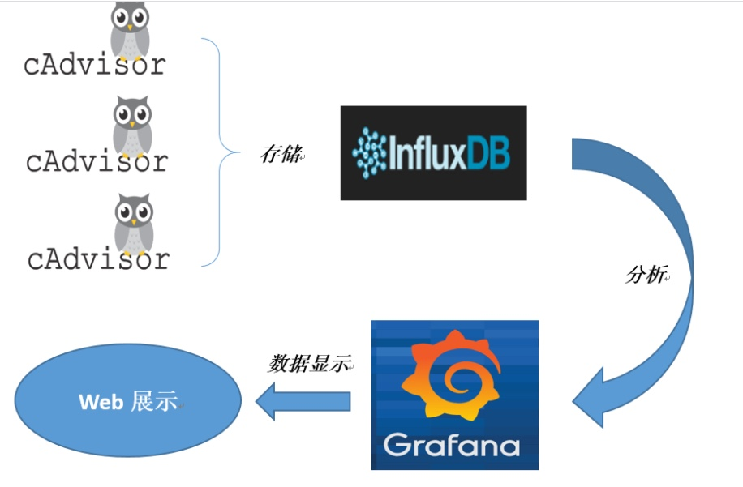
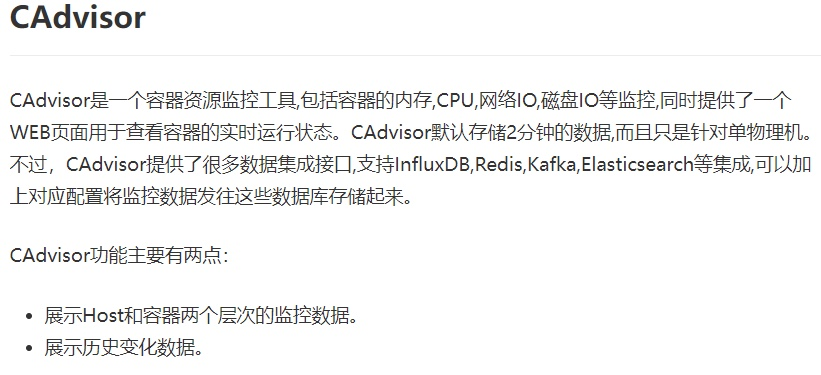
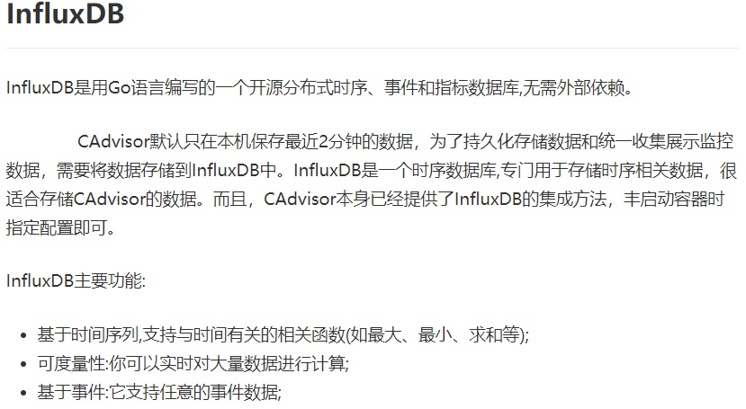
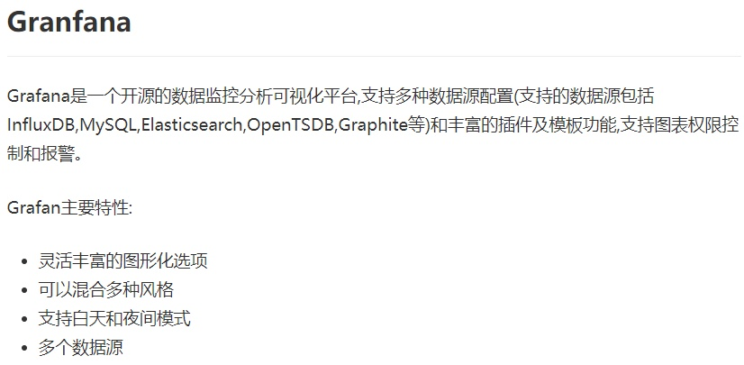
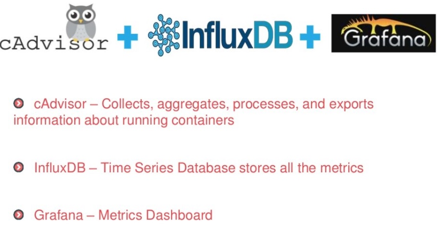

# 15 Docker容器监控只CAdvisor+InfluxDB+Granfana (TODO)

## 1. 原生命令
```shell
➜  ~ docker ps
➜  ~ docker stats
CONTAINER ID   NAME       CPU %     MEM USAGE / LIMIT     MEM %     NET I/O         BLOCK I/O     PIDS
b2afb8305881   tomcat82   0.08%     207.7MiB / 7.674GiB   2.64%     3.62kB / 658B   0B / 27.7MB   52
eae05ff9c760   tomcat81   0.10%     149.3MiB / 7.674GiB   1.90%     4.19kB / 658B   0B / 27.9MB   53
```

### 问题
通过`docker stats`命令可以很方便的看到当前宿主机器上所有的容器CPU，内存以及网络流量等数据，一般小公司够用了。。。。

但是，`docker stats`统计结果只能是当前宿主机的全部容器，数据资料是实时的，没有地方存储、没有健康指标过线预警等功能


## 2. 是什么 
容器监控3剑客。

一句话：CAdvisor监控收集 + InfluxDB存储数据 + Granfana展示图表



### 1. CAdvisor


### 2. InfluxDB


### 3. Granfana


### 总结



## 3. compose容器编排，一套带走 (TODO)