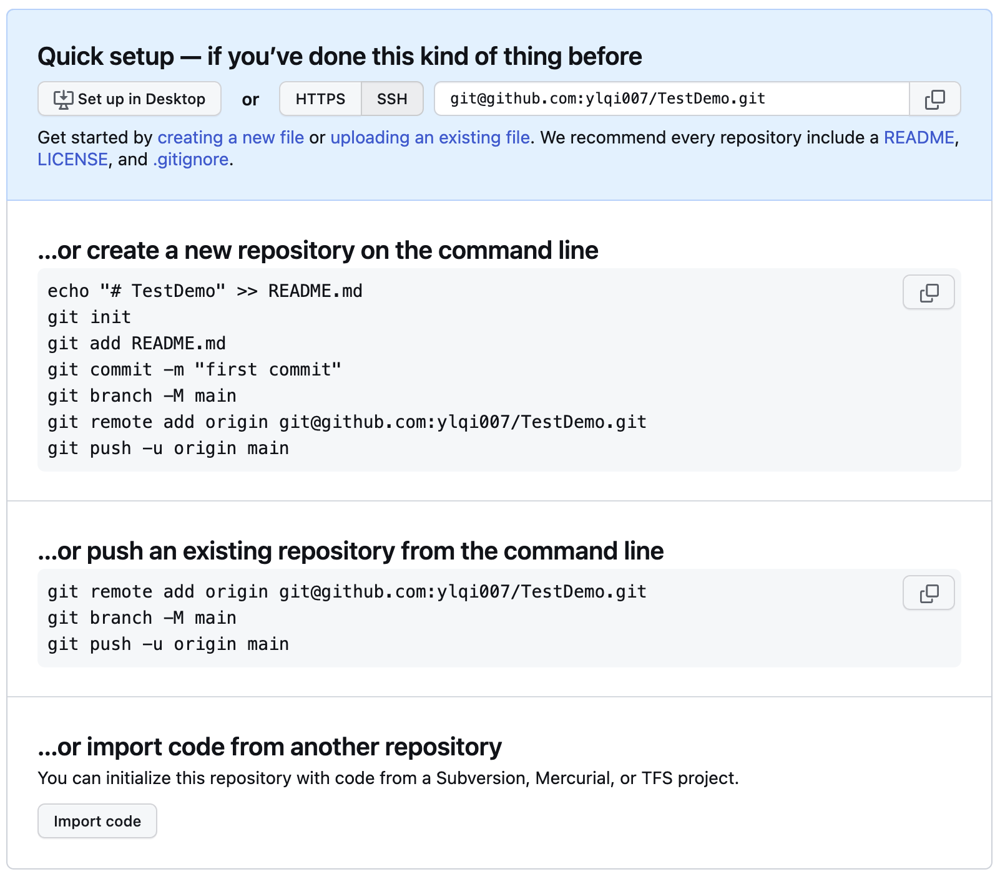

How should you connect local and remote repositories when you have a local repository and then you create a repository on GitHub?

When creating a remote repository, if you don't choose to initialize this repository with a README file, the GitHub Quick Settings page for a new GitHub repository will appear as follows



## 1. Initialization
### 1. Create a new repository on the command line
```shell
echo "# TestDemo" >> README.md
git init
git add README.md
git commit -m "first commit"
git branch -M main
git remote add origin git@github.com:ylqi007/TestDemo.git
git push -u origin main
```

### 2. Push an existing repository from the command line
```shell
git remote add origin git@github.com:ylqi007/TestDemo.git
git branch -M main
git push -u origin main
```

## Others
### 1. Rename a repository
When you rename a repository, all existing information, with the exception of project site URLs, is automatically redirected to the new name, including:
* Issues
* Wikis
* Stars
* Followers

In addition to redirecting web traffice, all `git clone`, `git fetch`, or `git push` operations targeting the previous location will continue to function as if made on the new location. However, to reduce confusion, we strongly recommend updating any existing local clones to point to the new repository URL. You can do this by using `git remote` on the command line:
```shell
git remote set-url origin <NEW_URL>
git remote set-url origin git@github.com:ylqi007/notebooks-old.git
```

**Reference**
* [Renaming a repository](https://docs.github.com/en/repositories/creating-and-managing-repositories/renaming-a-repository)