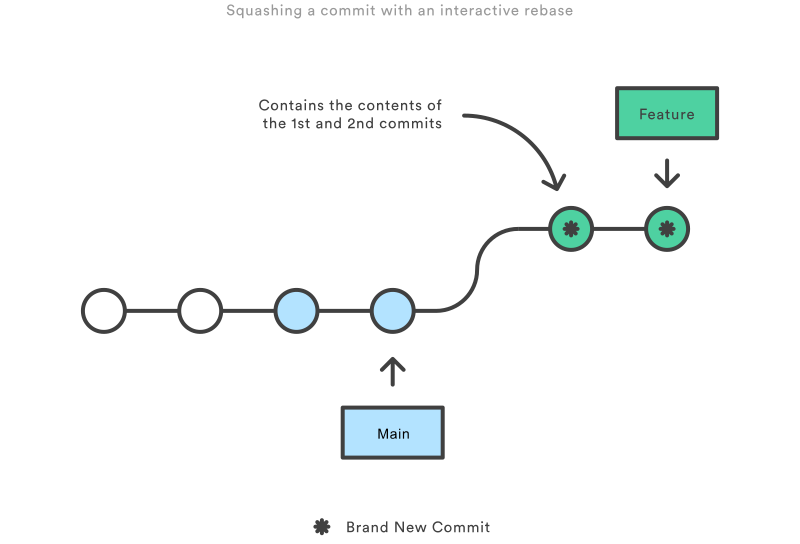

# Merging vs Rebasing
The first thing to understand about `git rebase` is that it solves the same problem as `git merge`. Both of these commands
are designed to integrate changes from one branch into another branch -- they just do it in different ways.


In above case, the new commmits in `main` are relevant to the feature that you're working on. To incorporate the new commits into your `ferature` branch, you have two options: merging or rebasing.


## Merging
The easiest option is to merge the `main` branch into the `feature` branch:
```shell
git checkout feature
git merge main

# or you can condense this into a one-liner
git merge feature main
```
This creates a new commit "merge commit" in the `feature` branch that ties together the histories of both branches, giving you a branch structure that looks like this:


Merging is nice because it's non-destructive operation. The existing branches are not changed in any way. This avoids all of the potential pitfalls of rebasing. [合并比较好是因为它是一种非破坏性的操作。现有的分支不会以任何方式改变(原有的main,feature提交历史记录都不会发生改变，只是feature分支上新加了一个合并后的commit)这避免了变基操作的所有潜在陷阱]。

On the other hand, this also means that the `feature` branch will have an extraneous merge commit every time you need to incorporate upstream changes. If `main` is very active, this can pollute your `feature` branch's history quite a bit. While it's possible to mitigate this issue with advanced `git log` options, it can make it hard for other developers to understand the history of the project. [简而言之，会pollute `feature` branch's history]


## Rebasing
As an alternative to merging, you can rebase the `feature` branch onto `main` branch using the following commands
```shell
git checkout feature
git rebase main
```
This moves the entire `feature` branch to begin on the tip of the `main` branch, effectively incorporating all of the new commits in `main`. But, instead of using a merge commit, rebasing re-writes the project history be creating branch new commits for each commit in the original branch. [变基将整个`feature`分支移动到`main`分支的顶端，有效地包含所有`main`分支上的新commits。但是，变基不使用合并提交，而是通过为原有分支中的每个commit创建全新的commit来重写历史记录]


The major benefit of rebasing is that you get a much cleaner project history. First, it eliminates the unnecessary merge commits required by `git merge`. Second, as you can see in the above diagram, rebasing also results in a perfectly linear project history—you can follow the tip of `feature` all the way to the beginning of the project without any forks. This makes it easier to navigate your project with commands like `git log`, `git bisect`, and `gitk`.


## Interactive Rebasing
Interactive rebasing gives you the opportunity to alter commits as they are moved to the new branch. This is even more powerful than an automated rebase, since it offers complete control over the branch’s commit history. Typically, this is used to clean up a messy history before merging a feature branch into `main`.
```shell
git checkout feature
git rebase -i main
```

Eliminating insignificant commits like this makes your feature's history much easier to understand. This is something that `git merge` simply cannot do.


## The Golden Rule of Rebasing
Once you understand what rebasing is, the most important thing to learn is when **not** to do it. **The golden rule of `git rebase` is to never use in on "public" branches.** (`git rebase`的黄金法则是**永远不要在公共分支上使用它**。)

For example, think about what would happen if you rebased `main` onto your `feature` branch.

The rebase moves all of the commits in `main` onto the tip of `feature`. The problem is that this only happened in *your repository*. All of the other developers are still working with the original `main`. Since rebasing results in brand new commits, Git will think that your `main` branch's history has diverged from everybody else's.

The only way to synchronize the two `main` branches is to merge them back together, resulting in an extra merge commit and two sets of commits that contain the same changes (the original ones, and the ones from your rebased branch). Needless to say, this is a very confusing situation. 

So, before you run `git rebase`, alwasy ask yourself, "Is anyone else looking at this branch?" If the answer is yes, take your hands off the keyboard and starting thinking about a non-destructive way to make your changes (e.g. the `git revert` command). Otherwise, you're safe to re-write history as much as you like. 


## Workflow Walkthrough (工作流程演练)
Rebasing can be incorporated into your existing Git workflow as much or as less as your team is comfortable with. 

* https://www.atlassian.com/git/tutorials/merging-vs-rebasing#workflow-walkthrough


## Reference
* [Merging vs. Rebasing](https://www.atlassian.com/git/tutorials/merging-vs-rebasing)
* [git rebase VS git merge？ 更优雅的 git 合并方式值得拥有](https://juejin.cn/post/6844903890295455751)