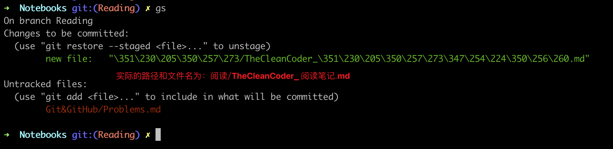
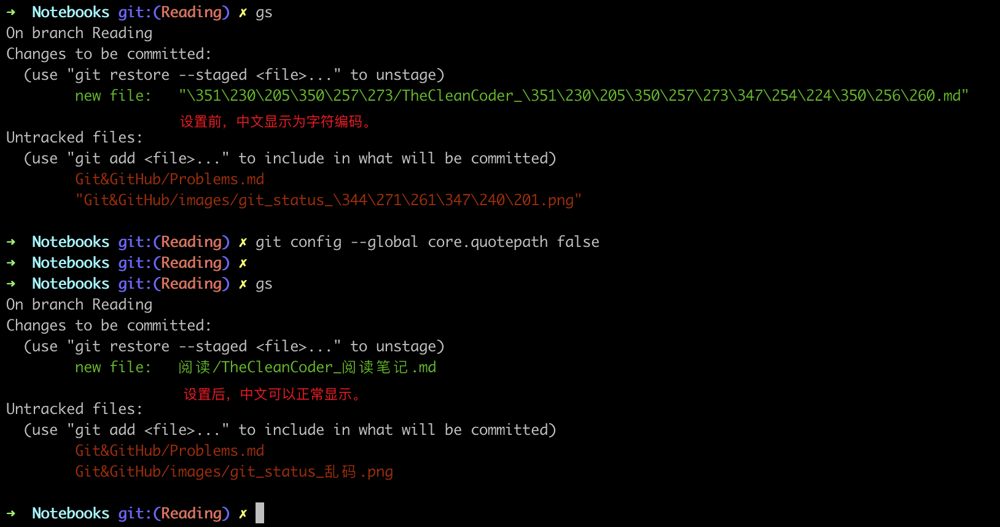

## 乱码
在使用`git status`查看workspace中的状态时，中文文件名总会显示成乱码。

```bash
git config --global core.quotepath false
```



Reference: [git status 显示中文和解决中文乱码](https://blog.csdn.net/u012145252/article/details/81775362)