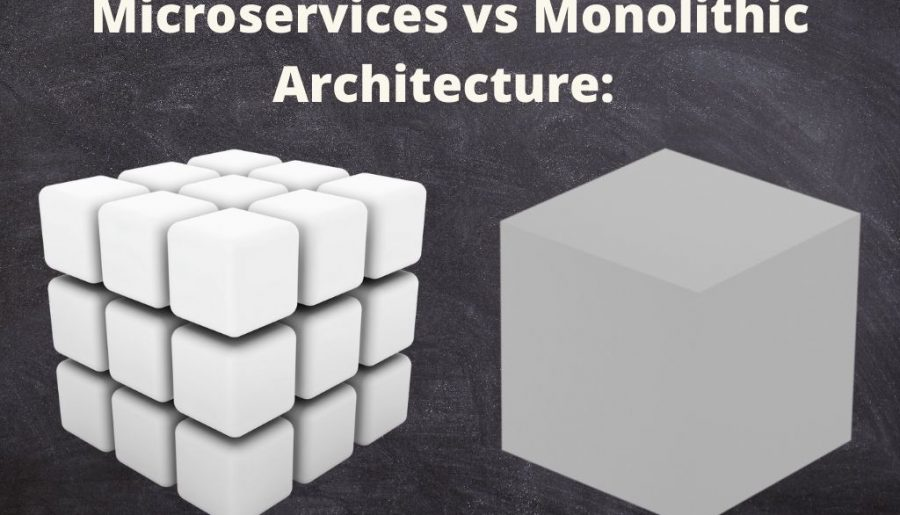
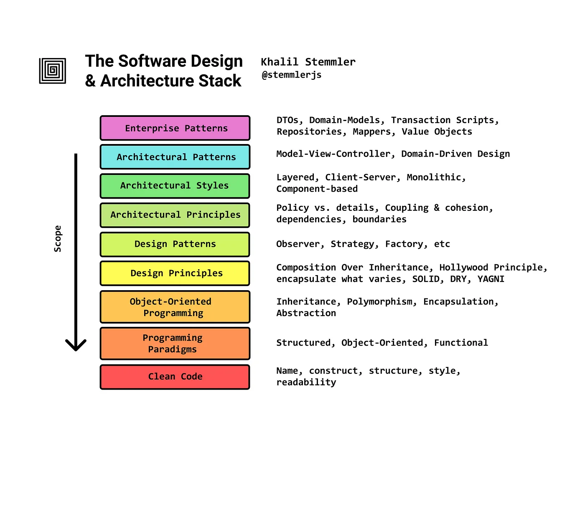

# 微服务
微服务是一种开发软件的架构和组织方法，其中软件由通过明确定义的API进行通信的小型独立服务组成。这些服务由各个小型独立团队负责。

微服务架构使应用程序更易于扩展和更快地开发，从而加速创新并缩短新功能的上市时间。

## 单体式架构 vs 微服务架构
传统的应用构件方法专注于**单体式架构**。在单体式架构中，一个应用内的所有功能和服务都锁在一起，作为一个单元来运行。以任何方式对应用进行增添或改进时，其架构会变得愈加复杂。这使得在不拆开整个应用的前提下，优化应用中的任何单一功能都变得更加困难。这也意味着，如果应用中的一个进程需要扩展，那么整个应用也都必须扩展。

在**微服务架构**中，应用中的每一个核心功能都能独立运行。这样，开发团队可以构建和更新新的组建，以满足不断变化的业务需求，而不必中断整个引用。

## The Software Design & Architecture Stack

## Reference
* https://aws.amazon.com/cn/microservices/
* https://www.redhat.com/zh/topics/microservices/what-are-microservices
* https://blog.minervavisuals.co/microservices-vs-monoliths/
* https://ideausher.com/blog/monolith-vs-microservices/
* https://medium.com/@unbug/%E5%A6%82%E4%BD%95%E7%B3%BB%E7%BB%9F%E5%AD%A6%E4%B9%A0%E8%BD%AF%E4%BB%B6%E8%AE%BE%E8%AE%A1%E5%92%8C%E6%9E%B6%E6%9E%84-816bbc3456e7
* https://github.com/stemmlerjs/software-design-and-architecture-roadmap
* [李乾坤的博客](https://qiankunli.github.io/)
* [如何学习架构](https://qiankunli.github.io/2019/04/19/learn_architecture.html)
* [博客园: 有梦想的肥宅](https://www.cnblogs.com/riches)
* [[架构] 从零开始学软件架构：架构设计分层实现](https://www.jonsam.site/2022/03/24/software-architecture-1/)